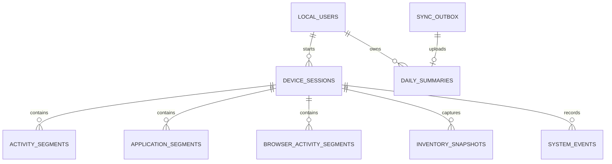

# Activity Watch Local Database Structure

## 1. Status and scope

**Status:** Approved MVP schema; persistence foundation implemented.

This document defines the operating-system-neutral local database for the
Activity Watch agent. It deliberately uses a compact **10-table schema**
suitable for the first release.

The selected database is **SQLite encrypted with SQLCipher**. Flutter Hive is
not used because the feature needs transactions, relational integrity,
time-range indexes, crash recovery, and a durable synchronization outbox.

The database must never store:

- ERP passwords;
- actual keystrokes or typed content;
- clipboard content;
- screenshots;
- mouse coordinates;
- full URLs, query parameters, page content, or form content; or
- process command-line arguments by default.

All timestamps are RFC 3339 UTC strings such as
`2026-08-04T12:15:05Z`. The device timezone is stored separately for local
date calculation and report display.

## 2. Platform scope and capability rules

The database and synchronization contract support:

- Windows;
- macOS;
- Linux, including X11 and Wayland capability differences;
- Android;
- iOS/iPadOS;
- ChromeOS where an approved native or enterprise integration is available;
  and
- future operating systems through the `other` platform value.

Collection is capability-based. The server policy may enable a feature only
when both the operating system and the installed agent report that capability.
Missing capability data is reported as unavailable or untracked; it is never
invented or converted to active time.

| Platform | Expected capability |
|---|---|
| Windows desktop | Full desktop agent: lifecycle, idle, foreground applications, process inventory, system services, browser extension |
| macOS desktop | Desktop agent with user-granted Accessibility/Automation permissions; launchd and browser integration where permitted |
| Linux desktop | Desktop agent where the desktop environment exposes required APIs; Wayland may restrict foreground-window and idle information |
| Android | Restricted agent using user-approved usage-access, foreground service, device-owner, or MDM APIs where available |
| iOS/iPadOS | Restricted companion; third-party apps cannot continuously inspect other applications or global keyboard/mouse activity |
| ChromeOS | Restricted unless managed-device or supported Linux/native integration exposes the required capability |

The first full-featured implementations should target Windows, macOS, and
Linux. Android, iOS/iPadOS, and ChromeOS must use the same database contract
but store only data that their operating-system APIs and user permissions
lawfully expose.

Platform examples for idle detection include Windows `GetLastInputInfo`,
macOS event-idle APIs, and Linux desktop/session APIs. These are implemented
behind platform adapters. No platform may use keylogging or record input
content.

## 3. Storage decision

### Decision

Use 10 tables for the first release and keep low-volume or policy-shaped data
inside encrypted JSON payloads. Add more normalized tables only if real query,
retention, or performance requirements justify them.

### Why

The earlier 24-table proposal was technically normalized but too complex for
an initial desktop agent. It increased migration, repository, synchronization,
and recovery code before those extra relations had demonstrated value.

### Simplifications

| Earlier separation | MVP approach |
|---|---|
| Local user, device, and consent tables | Combined in `local_users` |
| Activity and connectivity tables | `network_state` is stored on each activity segment |
| Application catalog and segment tables | Application identity is stored directly on each consolidated segment |
| Process/service catalogs, items, and events | Deduplicated encrypted payloads in `inventory_snapshots` |
| Separate service state table | Service changes are `system_events` |
| Policy, keyword, settings, and health tables | Versioned keys in `agent_state` |
| Daily application/category child tables | Encrypted summary payloads in `daily_summaries` |
| Synchronization history table | Latest attempt data remains on `sync_outbox`; diagnostics use bounded logs |

### Consequence

The MVP is easier to implement and maintain. Direct SQL reporting against raw
local application, browser, process, and service details is intentionally
limited. The agent produces validated daily summaries before synchronization,
and the ERP server stores the reportable normalized data.

Schema version 1 is now created transactionally by the opt-in Activity Watch
persistence layer. This document supersedes the earlier draft schema.

## 4. Database overview



The 10 tables are:

1. `local_users`
2. `device_sessions`
3. `activity_segments`
4. `application_segments`
5. `browser_activity_segments`
6. `inventory_snapshots`
7. `system_events`
8. `daily_summaries`
9. `sync_outbox`
10. `agent_state`

## 5. Table purposes

### 5.1 `local_users`

Stores the approved ERP identity, employee, tenant, device, operating-system account,
timezone, and consent state for this installation.

Important rules:

- no ERP password is stored;
- `os_user_identity_hash` is a keyed hash of the platform account identifier,
  not a plain Windows SID, macOS user UUID, Linux UID, or mobile account ID;
- the row is bound to the server-issued `device_id`;
- `company_id` and `branch_id` come from approved enrollment; and
- tracking is allowed only while consent is active and the device is not
  revoked.

### 5.2 `device_sessions`

Represents a continuous authorized tracking session for an operating-system
user.

It records platform session and boot identifiers, UTC and monotonic start/end
values, start/end reasons, agent and policy versions, and timezone details.

Reasons include login, unlock, resume, agent start, logout, lock, sleep,
shutdown, service stop, and crash recovery.

### 5.3 `activity_segments`

Stores consolidated user-activity intervals instead of one row per sample.

Activity states:

- `active`
- `idle`
- `locked`
- `sleeping`
- `logged_out`
- `unknown`

Network state is recorded on the same segment as `online`, `offline`, or
`unknown`. When either activity or network state changes, the current segment
is closed and a new one begins. This preserves the fact that a user can be
active while offline without needing a separate connectivity table.

Idle state is calculated through the approved platform adapter. The agent
records only the elapsed time since the last input and never captures actual
keys, mouse coordinates, gestures, or content. When an operating system does
not expose global idle information, the interval is `unknown` or `untracked`.

### 5.4 `application_segments`

Stores consolidated foreground-application intervals.

It contains process name, executable name, optional encrypted executable
path, publisher, classification, start/end time, and duration. Optional window
titles are encrypted at the column level and remain null when policy does not
allow title collection.

Application classifications are productive, communication, development,
browser, system, entertainment, or unclassified.

### 5.5 `browser_activity_segments`

Stores consolidated activity for the approved active browser tab only.

Normally it stores browser, category, matched rule identifier, and duration.
An optional domain uses a keyed HMAC. An optional raw title is encrypted and
retained locally only when the administrator privacy policy explicitly allows
it.

Private/incognito titles and domains are discarded. Full URLs, query strings,
page content, form content, and passwords are never stored.

### 5.6 `inventory_snapshots`

Stores deduplicated background-process or operating-system service/daemon
inventories.

`inventory_type` identifies `processes` or `system-services`. The canonicalized
inventory is encrypted into one payload. `snapshot_hash` prevents inserting
the same unchanged inventory repeatedly.

Process payloads contain approved fields such as process name, executable
name, optional publisher, and instance count. System-service payloads contain
platform-appropriate identifiers such as Windows service, macOS launchd, or
Linux systemd metadata. Command-line arguments are excluded.

### 5.7 `system_events`

Stores discrete lifecycle and diagnostic events, including:

- boot and shutdown;
- operating-system login and logout;
- lock and unlock;
- sleep and resume;
- network online and offline;
- timezone and system-clock changes;
- agent start, stop, and crash recovery; and
- system service or daemon state changes detected between inventory snapshots.

Optional metadata is encrypted and must contain only policy-approved fields.

### 5.8 `daily_summaries`

Stores one revision-controlled summary per local user, device, and local work
date.

The directly queryable columns contain state totals and first/last activity.
Application, browser, process, and service breakdowns are encrypted JSON
payloads because they are read and uploaded as summary units rather than
joined locally.

`offline_seconds` may overlap active or idle time, so it is not added to
`tracked_seconds`.

### 5.9 `sync_outbox`

Implements durable offline synchronization.

Each row contains an encrypted payload, checksum, unique idempotency key,
delivery state, retry schedule, attempt count, and latest sanitized result.

Valid states are pending, processing, synced, retry, and permanently-failed.
Tokens, encryption keys, decrypted payloads, and raw server responses are not
stored.

### 5.10 `agent_state`

Stores small versioned agent values using a key/value structure.

Examples:

- active policy and policy version;
- browser keyword rules;
- sampling and retention settings;
- last heartbeat, collection, and successful sync times;
- database size and pending outbox count;
- agent version and last sanitized error code; and
- schema-related state; and
- reported platform capabilities and permission status.

Values are encrypted. SQLCipher keys, column-encryption keys, access tokens,
and refresh tokens must remain protected by the operating system's secure
credential store outside this table.

## 6. SQLCipher-compatible schema

The application supplies the database key from memory after unlocking it with
the operating system's secure credential store. The placeholder below is
documentation only and must never become a hard-coded production key.

```sql
PRAGMA key = '<32-byte key supplied from OS-secured memory>';
PRAGMA cipher_compatibility = 4;
PRAGMA foreign_keys = ON;
PRAGMA journal_mode = WAL;
PRAGMA synchronous = FULL;
PRAGMA secure_delete = ON;
PRAGMA busy_timeout = 5000;

CREATE TABLE local_users (
    id TEXT PRIMARY KEY,
    server_user_id TEXT NOT NULL,
    employee_id TEXT,
    company_id TEXT NOT NULL,
    branch_id TEXT,
    device_id TEXT NOT NULL,
    platform TEXT NOT NULL CHECK (
        platform IN (
            'windows',
            'macos',
            'linux',
            'android',
            'ios',
            'chromeos',
            'other'
        )
    ),
    os_version TEXT,
    device_name TEXT,
    os_user_identity_hash TEXT NOT NULL,
    timezone TEXT NOT NULL,
    consent_policy_version INTEGER NOT NULL,
    consent_text_hash TEXT NOT NULL,
    consented_at_utc TEXT NOT NULL,
    consent_revoked_at_utc TEXT,
    created_at_utc TEXT NOT NULL,
    last_authenticated_at_utc TEXT,
    UNIQUE (server_user_id, device_id)
);

CREATE TABLE device_sessions (
    id TEXT PRIMARY KEY,
    local_user_id TEXT NOT NULL,
    os_session_id TEXT,
    boot_id TEXT NOT NULL,
    started_at_utc TEXT NOT NULL,
    ended_at_utc TEXT,
    start_monotonic_ms INTEGER NOT NULL,
    end_monotonic_ms INTEGER,
    start_reason TEXT NOT NULL,
    end_reason TEXT,
    agent_version TEXT NOT NULL,
    policy_version INTEGER NOT NULL,
    timezone TEXT NOT NULL,
    timezone_offset_minutes INTEGER NOT NULL,
    is_finalized INTEGER NOT NULL DEFAULT 0 CHECK (is_finalized IN (0, 1)),
    created_at_utc TEXT NOT NULL,
    FOREIGN KEY (local_user_id)
        REFERENCES local_users(id) ON DELETE RESTRICT
);

CREATE TABLE activity_segments (
    id TEXT PRIMARY KEY,
    session_id TEXT NOT NULL,
    activity_state TEXT NOT NULL CHECK (
        activity_state IN (
            'active',
            'idle',
            'locked',
            'sleeping',
            'logged_out',
            'unknown'
        )
    ),
    network_state TEXT NOT NULL DEFAULT 'unknown' CHECK (
        network_state IN ('online', 'offline', 'unknown')
    ),
    started_at_utc TEXT NOT NULL,
    ended_at_utc TEXT,
    start_monotonic_ms INTEGER,
    end_monotonic_ms INTEGER,
    duration_seconds INTEGER CHECK (
        duration_seconds IS NULL OR duration_seconds >= 0
    ),
    last_input_at_utc TEXT,
    idle_threshold_seconds INTEGER NOT NULL,
    confidence TEXT NOT NULL DEFAULT 'confirmed' CHECK (
        confidence IN ('confirmed', 'inferred', 'uncertain')
    ),
    created_at_utc TEXT NOT NULL,
    FOREIGN KEY (session_id)
        REFERENCES device_sessions(id) ON DELETE CASCADE
);

CREATE TABLE application_segments (
    id TEXT PRIMARY KEY,
    session_id TEXT NOT NULL,
    process_fingerprint TEXT NOT NULL,
    process_name TEXT NOT NULL,
    executable_name TEXT,
    executable_path_encrypted BLOB,
    path_nonce BLOB,
    path_tag BLOB,
    publisher TEXT,
    signature_status TEXT,
    classification TEXT NOT NULL DEFAULT 'unclassified' CHECK (
        classification IN (
            'productive',
            'communication',
            'development',
            'browser',
            'system',
            'entertainment',
            'unclassified'
        )
    ),
    window_title_encrypted BLOB,
    title_nonce BLOB,
    title_tag BLOB,
    started_at_utc TEXT NOT NULL,
    ended_at_utc TEXT,
    start_monotonic_ms INTEGER,
    end_monotonic_ms INTEGER,
    duration_seconds INTEGER CHECK (
        duration_seconds IS NULL OR duration_seconds >= 0
    ),
    created_at_utc TEXT NOT NULL,
    FOREIGN KEY (session_id)
        REFERENCES device_sessions(id) ON DELETE CASCADE
);

CREATE TABLE browser_activity_segments (
    id TEXT PRIMARY KEY,
    session_id TEXT NOT NULL,
    browser_name TEXT NOT NULL,
    domain_hmac TEXT,
    tab_title_encrypted BLOB,
    title_nonce BLOB,
    title_tag BLOB,
    keyword_rule_id TEXT,
    category TEXT,
    started_at_utc TEXT NOT NULL,
    ended_at_utc TEXT,
    duration_seconds INTEGER CHECK (
        duration_seconds IS NULL OR duration_seconds >= 0
    ),
    privacy_disposition TEXT NOT NULL DEFAULT 'category-only' CHECK (
        privacy_disposition IN (
            'category-only',
            'raw-title-local',
            'excluded'
        )
    ),
    created_at_utc TEXT NOT NULL,
    FOREIGN KEY (session_id)
        REFERENCES device_sessions(id) ON DELETE CASCADE
);

CREATE TABLE inventory_snapshots (
    id TEXT PRIMARY KEY,
    session_id TEXT NOT NULL,
    inventory_type TEXT NOT NULL CHECK (
        inventory_type IN ('processes', 'system-services')
    ),
    snapshot_hash TEXT NOT NULL,
    item_count INTEGER NOT NULL CHECK (item_count >= 0),
    payload_encrypted BLOB NOT NULL,
    payload_nonce BLOB NOT NULL,
    payload_tag BLOB NOT NULL,
    captured_at_utc TEXT NOT NULL,
    created_at_utc TEXT NOT NULL,
    UNIQUE (session_id, inventory_type, snapshot_hash),
    FOREIGN KEY (session_id)
        REFERENCES device_sessions(id) ON DELETE CASCADE
);

CREATE TABLE system_events (
    id TEXT PRIMARY KEY,
    session_id TEXT,
    boot_id TEXT,
    event_type TEXT NOT NULL,
    event_at_utc TEXT NOT NULL,
    monotonic_ms INTEGER,
    metadata_encrypted BLOB,
    metadata_nonce BLOB,
    metadata_tag BLOB,
    created_at_utc TEXT NOT NULL,
    FOREIGN KEY (session_id)
        REFERENCES device_sessions(id) ON DELETE CASCADE
);

CREATE TABLE daily_summaries (
    id TEXT PRIMARY KEY,
    local_user_id TEXT NOT NULL,
    device_id TEXT NOT NULL,
    work_date_local TEXT NOT NULL,
    timezone TEXT NOT NULL,
    policy_version INTEGER NOT NULL,
    first_active_at_utc TEXT,
    last_active_at_utc TEXT,
    active_seconds INTEGER NOT NULL DEFAULT 0 CHECK (active_seconds >= 0),
    idle_seconds INTEGER NOT NULL DEFAULT 0 CHECK (idle_seconds >= 0),
    locked_seconds INTEGER NOT NULL DEFAULT 0 CHECK (locked_seconds >= 0),
    sleep_seconds INTEGER NOT NULL DEFAULT 0 CHECK (sleep_seconds >= 0),
    offline_seconds INTEGER NOT NULL DEFAULT 0 CHECK (offline_seconds >= 0),
    unknown_seconds INTEGER NOT NULL DEFAULT 0 CHECK (unknown_seconds >= 0),
    tracked_seconds INTEGER NOT NULL DEFAULT 0 CHECK (tracked_seconds >= 0),
    application_summary_encrypted BLOB,
    application_summary_nonce BLOB,
    application_summary_tag BLOB,
    browser_summary_encrypted BLOB,
    browser_summary_nonce BLOB,
    browser_summary_tag BLOB,
    inventory_summary_encrypted BLOB,
    inventory_summary_nonce BLOB,
    inventory_summary_tag BLOB,
    summary_checksum TEXT NOT NULL,
    revision INTEGER NOT NULL DEFAULT 1 CHECK (revision > 0),
    is_finalized INTEGER NOT NULL DEFAULT 0 CHECK (is_finalized IN (0, 1)),
    created_at_utc TEXT NOT NULL,
    updated_at_utc TEXT NOT NULL,
    UNIQUE (local_user_id, device_id, work_date_local),
    FOREIGN KEY (local_user_id)
        REFERENCES local_users(id) ON DELETE RESTRICT
);

CREATE TABLE sync_outbox (
    id TEXT PRIMARY KEY,
    entity_type TEXT NOT NULL,
    entity_id TEXT NOT NULL,
    operation TEXT NOT NULL,
    payload_encrypted BLOB NOT NULL,
    payload_nonce BLOB NOT NULL,
    payload_tag BLOB NOT NULL,
    payload_checksum TEXT NOT NULL,
    idempotency_key TEXT NOT NULL UNIQUE,
    status TEXT NOT NULL DEFAULT 'pending' CHECK (
        status IN (
            'pending',
            'processing',
            'synced',
            'retry',
            'permanently-failed'
        )
    ),
    attempt_count INTEGER NOT NULL DEFAULT 0 CHECK (attempt_count >= 0),
    next_attempt_at_utc TEXT,
    last_attempt_at_utc TEXT,
    last_http_status INTEGER,
    last_error_code TEXT,
    response_checksum TEXT,
    created_at_utc TEXT NOT NULL,
    synced_at_utc TEXT
);

CREATE TABLE agent_state (
    key TEXT PRIMARY KEY,
    state_group TEXT NOT NULL CHECK (
        state_group IN (
            'schema',
            'policy',
            'keyword-rules',
            'settings',
            'health'
        )
    ),
    value_encrypted BLOB NOT NULL,
    value_nonce BLOB NOT NULL,
    value_tag BLOB NOT NULL,
    server_version INTEGER,
    updated_at_utc TEXT NOT NULL
);

CREATE INDEX idx_device_sessions_user_started
    ON device_sessions(local_user_id, started_at_utc);

CREATE INDEX idx_activity_segments_session_started
    ON activity_segments(session_id, started_at_utc);

CREATE INDEX idx_activity_segments_state_started
    ON activity_segments(activity_state, started_at_utc);

CREATE INDEX idx_application_segments_session_started
    ON application_segments(session_id, started_at_utc);

CREATE INDEX idx_browser_segments_session_started
    ON browser_activity_segments(session_id, started_at_utc);

CREATE INDEX idx_inventory_session_type_captured
    ON inventory_snapshots(session_id, inventory_type, captured_at_utc);

CREATE INDEX idx_system_events_session_event
    ON system_events(session_id, event_at_utc);

CREATE INDEX idx_system_events_type_event
    ON system_events(event_type, event_at_utc);

CREATE INDEX idx_daily_summaries_user_date
    ON daily_summaries(local_user_id, work_date_local);

CREATE INDEX idx_sync_outbox_dispatch
    ON sync_outbox(status, next_attempt_at_utc);

CREATE INDEX idx_agent_state_group
    ON agent_state(state_group, updated_at_utc);
```

## 7. Segment-writing behavior

The sampling interval does not create database rows by itself.

When activity state, network state, or foreground application remains the
same, the agent keeps the current segment open. When it changes, the agent:

1. closes the current segment;
2. calculates duration using monotonic time where available;
3. starts the next segment;
4. updates the affected daily summary; and
5. adds an outbox row only when a synchronization checkpoint is due.

Segment closing and daily-summary updates must use one transaction.

## 8. Required transaction boundaries

The following operations are atomic:

1. Close an activity/application/browser segment and start its replacement.
2. Close a segment and update the daily summary.
3. Update a daily summary and create its outbox checkpoint.
4. Mark an outbox row as synced with its latest acknowledgement details.
5. Replace policy or keyword-rule state with a verified newer version.
6. Apply a schema change and update the schema-version state.

## 9. Startup and recovery

On startup the agent must:

1. unlock the database key with the operating system's secure credential store;
2. apply the SQLCipher key before reading schema data;
3. run `PRAGMA cipher_integrity_check`;
4. enable foreign keys and journal settings;
5. find open sessions and segments;
6. close confirmed time through the last reliable heartbeat;
7. classify any unconfirmed gap as `unknown`;
8. record a crash-recovery system event;
9. return abandoned `processing` outbox rows to `retry`; and
10. create a higher daily-summary revision when repaired data changes totals.

Uncertain recovery time must never be counted as active.

## 10. Retention

Suggested starting values, subject to administrator policy and legal review:

| Data | Suggested local retention |
|---|---:|
| Unsynced outbox | Until acknowledged or manually resolved |
| Activity and application segments | 30 days |
| Raw browser titles, when enabled | 7 days |
| Process/service inventory | 14–30 days |
| Daily summaries | 90 days |
| Diagnostic logs | 14 days |

Cleanup must delete acknowledged detail first, run in small transactions,
checkpoint the WAL, and vacuum only while the computer is idle and preferably
connected to external power.

## 11. Encryption and key management

- Generate a unique random 256-bit SQLCipher key per operating-system
  user/device
  enrollment.
- Protect it with the platform secure store:
  - Windows: DPAPI `CurrentUser` or an approved CNG/TPM-backed key;
  - macOS/iOS: Keychain, with Secure Enclave backing where appropriate;
  - Linux: Secret Service/libsecret or an approved TPM-backed key store;
  - Android: Android Keystore, hardware-backed where available; and
  - ChromeOS: an approved managed-device secure storage facility.
- If secure key storage is unavailable, tracking must remain disabled; there is
  no plain-file fallback.
- Restrict the database directory using the platform's application sandbox,
  account permissions, and filesystem ACLs.
- Never store the raw key in configuration, registry text values, environment
  variables, command-line arguments, logs, or `agent_state`.
- Use a separate AES-256-GCM key for sensitive payload columns.
- Generate a unique random nonce and retain the authentication tag for each
  encrypted value.
- Use a separate keyed HMAC for domains and operating-system account
  identifiers.
- For rotation, stop writers, create and verify a protected backup, rekey the
  database, rewrap the new key with the platform secure store, reopen and
  verify it, then securely remove the temporary backup.
- If the platform-protected key is lost, local data is intentionally
  unrecoverable. Re-enroll the device and report the missing interval as a
  monitoring gap.

## 12. Validation rules

- Durations cannot be negative.
- Only one activity segment and one foreground-application segment may be open
  for a session at a time; this is enforced by the segment writer.
- A finalized summary can change only through a higher revision.
- A duplicate idempotency key with a different checksum is an integrity error.
- A private/incognito browser tab must produce no stored title or domain.
- `tracked_seconds` is calculated from mutually exclusive activity states.
- `offline_seconds` is calculated from `network_state` and may overlap tracked
  activity, so it is not added to `tracked_seconds`.
- Inventory hashes are calculated from canonicalized approved metadata before
  encryption.
- Each upload includes `platform`, agent capabilities, and permission state so
  the ERP can distinguish zero activity from activity that the OS could not
  collect.
- Decryption or authentication-tag failure quarantines the affected payload and
  creates a sanitized health error; corrupted data is never uploaded.

## 13. Platform adapter responsibilities

Every supported operating system implements the same interfaces:

| Adapter | Responsibility |
|---|---|
| Session lifecycle | Login/logout, lock/unlock, suspend/resume, shutdown where exposed |
| Idle provider | Duration since last user input without recording input content |
| Foreground application provider | Current approved application metadata where permitted |
| Inventory provider | Approved processes and system services/daemons |
| Browser bridge | Active approved browser tab through an extension/native bridge where supported |
| Secure storage | Protect SQLCipher, payload-encryption, and device credential keys |
| Startup integration | OS-appropriate service, daemon, login item, foreground service, or managed task |
| Capability reporter | Report supported, denied, unavailable, and temporarily-failed features |

Platform-specific permission denial is not an agent error. The agent records
the capability as denied, displays remediation to the user, and reports the
affected duration as untracked/unknown.

## 14. Acceptance criteria

- The schema contains no Windows-only column names.
- The same DDL opens on every supported SQLCipher platform.
- Each enrolled device records its platform and version.
- Platform account identifiers are stored only as keyed hashes.
- Missing operating-system capability never produces fabricated activity.
- Desktop and mobile capability differences are visible in ERP health reports.
- No platform implementation records actual input content.

## 15. When to add more tables later

The compact schema should be expanded only when at least one of these becomes
necessary:

- direct SQL filtering of individual applications or services is required;
- local retention differs per application, service, or category;
- encrypted inventory payloads become too large to rewrite efficiently;
- application metadata repetition materially increases database size;
- synchronization requires individual event acknowledgement; or
- measured query performance cannot meet the agreed target.

Until then, the 10-table structure is the approved MVP target.
