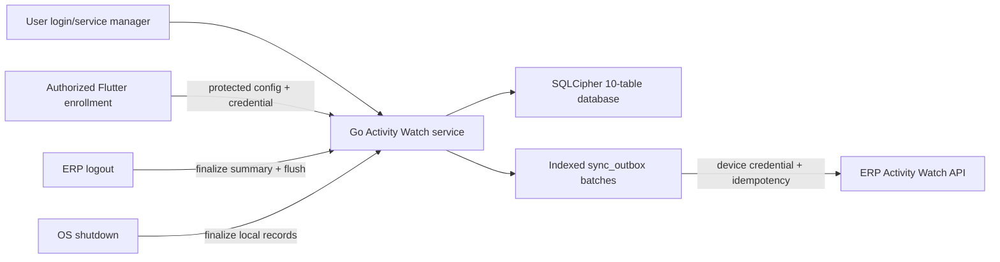
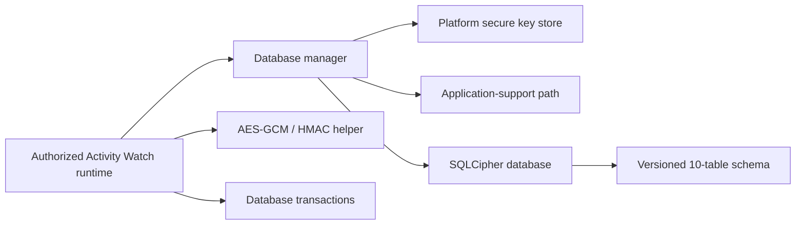

# Architecture

## Global status toast

`AppToast` owns one overlay entry above the active navigator and replaces it
before displaying a new message. The application root uses Flutter's standard
`ScaffoldMessenger`; toast behavior remains a separate overlay service so hot
restart cannot retain an unsupported custom messenger/inherited-widget state.

## CRM expected-value display formatting

`formatCrmExpectedValue` is the single presentation helper shared by the CRM
opportunity controller and register page. It parses a bounded scalar input in
O(1) time and O(1) space, maps absent or numeric-zero values to the `-`
placeholder, and otherwise preserves the API text. This is display-only: typed
models, API payloads, filtering, storage, and monetary calculations are not
changed. The existing `PurchaseRegisterColumn` remains the register component;
the Expected Value column uses its built-in centered alignment and an
appropriate flex allocation. The legacy read-only table uses the same centered
text alignment.

## CRM register filter presentation

CRM register pages reuse the Sales register's toggleable `PurchaseRegisterPage`
filter slot for inline search, date, and status controls. CRM Enquiries keeps
its existing SettingsWorkspace list/editor flow and renders the equivalent bar
inside the list pane. CRM Follow-ups keeps its timeline layout and renders its
From Date and To Date controls only when the same Filter action is active. Existing controller- or
page-owned filter state remains the source of truth; text-controller listeners
update the filtered rows locally.

## Browser session restoration

The existing shared-preference session store remains the single source of truth
for a browser refresh. App bootstrap restores any unexpired token, then keeps
the existing background `/auth/me` validation; only manual logout, expiry, or a
401/403 response clears the session. The legacy remember-me preference remains
cleared on logout for compatibility but no longer controls restoration.

## Activity Watch/manual attendance and payroll snapshots

ERP authentication does not write attendance. The paired Go agent sends a
minimal device-authenticated attendance event independently of the detailed
logout-only outbox. Device middleware resolves the employee; the backend
converts the UTC event to company-local time and insert-ignores a row protected
by `(employee_id, attendance_date)` uniqueness. Manual attendance is preserved
and remains available for employees without computers. The agent persists
unsent first check-ins locally and retries them after network or service
recovery.

Monthly attendance reuses the same `attendance_records` ledger. The Attendance
screen renders the all-employee response as a read-only monthly report filtered
to employees with persisted rows; a cell exists only when the ledger contains
that employee/date. Existing cells reuse the single-record attendance detail
and editor flow. Employee report metadata (department and active employment
status) travels in the same monthly response, so the grid does not issue
per-row lookups. The report paginates the already bounded monthly employee set
client-side after filter indexing. The report query includes inactive or
terminated employees eligible during the selected period, while write queries
remain active-only. The separate Bulk Attendance variation scopes the same API to
non-system employees and submits at most 15,000 employee/date decisions to
`POST /hr/attendance-monthly-sheet` without per-cell network calls. The backend revalidates company, user-link,
employment-period, weekly-off, future-date, and unique-key rules before one
transaction. A separately edited Activity Watch day is updated to a manual HR
decision, retaining its check timestamps; subsequent agent events preserve
that manual decision. Manual monthly rows store `draft` or
`submitted` state in the same ledger; payroll stops before calculation when a
selected period has unsubmitted manual drafts.
The monthly route remains registered for permission and refresh handling but is
hidden from drawer rendering; the Attendance register opens it through its
authorized Bulk Attendance page action.

Payroll processing locks the draft run, bulk-loads attendance and approved LOP
requests, and converts them into decimal scheduled/payable units. Existing
salary, statutory, payslip, accounting, permission, register, and dialog
components are reused. Run and line JSON snapshots preserve the selected policy,
structure, components, statutory result, and earned values. Payslips prefer the
snapshot and use current salary settings only for legacy rows.

The period algorithm is `O(E + A + L + D)` for employees, attendance, leave,
and bounded dates. Employee/date maps avoid repeated database queries and
duplicate counting.

## Activity Watch viewer scope

The Flutter Activity Watch page resolves the session's super-admin flag and
current company before loading reports. Only super administrators send explicit
`scope=company` and, when available, `company_id` query parameters to both
endpoints. The backend remains the authorization boundary and applies the
selected-company restriction. Every non-super-admin request remains restricted
by device owner.
Company summary pagination is consumed in 100-row batches. Summary ownership
uses a linked employee where available and otherwise a distinct user fallback,
so employee filters and labels do not collapse legacy devices into one name.
The Flutter report first retains the newest API-ordered cumulative snapshot for
each device/date, then uses an owner/date map to combine distinct devices into
one daily card. This is presentation-only, runs in expected linear time over
the bounded response/details, and does not alter API authorization or storage.

## Activity Watch self-service pairing

```mermaid
sequenceDiagram
    participant Employee as "Employee in ERP Web"
    participant API as "ERP pairing API"
    participant File as ".billingawpair file"
    participant Agent as "Installed Go agent"
    Employee->>API: Create pairing session (auth + consent)
    API-->>Employee: 30-minute token + pairing URL
    Employee->>File: Download versioned bundle
    Employee->>Agent: Open bundle through OS file association
    Agent->>Agent: Provision encrypted storage if absent
    Agent->>API: Token + locally generated credential
    API->>API: Lock device row; hash credential
    API-->>Agent: Device ID + batch URL
    Agent->>Agent: Protected writes; enable and restart service
```

Pairing state reuses `activity_watch_devices`; no fourth Activity Watch table is
introduced. Token lookup uses a unique hash and transactional row lock. The
browser handles only the short-lived token. Per-platform signed installers
register the pairing file and bootstrap a disabled service that cannot collect
until pairing succeeds.

On Windows, the installed launcher handles `.billingawpair` files. It invokes
the installed Go agent without a console window and displays either successful
connection or a safe pairing failure, without exposing a token or credential.
If Windows denies creation of the user Scheduled Task after a successful
exchange, the paired configuration remains valid and the launcher reports the
separate startup limitation. A Windows installer update requests elevation,
stops and waits for the existing service/process, replaces the executable, then
restarts the already-installed service (or starts a direct paired process only
when no service exists).

## Activity Watch desktop runtime

The implemented desktop runtime is a Go user-service executable under
`activity-watch-agent`. It is managed in the enrolled user's login context by
Windows, launchd, or the Linux service manager and remains independent of the
Flutter application's lifecycle while that OS session exists. On Windows, the
release builder embeds this Go binary and the per-user installation script in a
small .NET Framework launcher so employees receive one executable without an
IExpress/MakeCAB dependency.



### Runtime responsibilities

- Service host: install/start/stop integration and bounded lifecycle callbacks.
- Worker: coordinate collection, the ERP-logout outbox flush, and graceful
  shutdown. It does not upload on a timer, agent start, summary revision, or
  shutdown.
- Store: apply the SQLCipher key first, verify cipher/schema, and transact each
  approved lifecycle event with its pending outbox record. It is the business
  writer and uses the tested encrypted WAL configuration; helpers must not
  open the database directly.
- Collector: use bounded OS commands/APIs to return idle duration, lock state,
  foreground executable identity/category, foreground browser title,
  process/service names, and content-free keyboard/pointer activity signals.
  Missing capabilities return empty/zero observations. No input value, click,
  coordinate, URL, screenshot, clipboard, or page content crosses this boundary.
  High-frequency Windows activity probes call User32/Kernel32 directly so a
  sample does not depend on PowerShell startup or script timing. Windows
  process inventory uses a native Toolhelp process snapshot and records only
  executable names. Lower-frequency Windows service and USB inventory commands
  use encoded UTF-16LE PowerShell transport; this is transport protection, not
  encryption of collected data.
- Store/aggregator: consolidate state/application/input samples, encrypt browser
  titles and inventory payloads, produce bounded daily title/process projections,
  generate revisioned summaries, and purge synchronized data after 90 days.
- Syncer: select bounded indexed batches, upload encrypted payloads plus their
  approved reporting projection, and schedule retries. A row becomes synced
  only after a bounded JSON success envelope confirms the complete accepted
  count; an HTML/malformed/mismatched HTTP 2xx response remains retryable.
- Server logout control: poll the device-authenticated control flag, drain the
  complete indexed outbox, then send a separate authenticated acknowledgement.
  Separating completion from the final batch handles empty queues and exact
  batch-size multiples. The server retains the flag when upload or
  acknowledgement fails, so the next poll retries safely.
- Secret provider: supply database and device credentials without placing them
  in configuration or logs.
- Provisioner: generate and publish a new encrypted database/key pair only
  when both configured targets are absent. It builds files under protected
  temporary names and uses no-replace publication to avoid overwriting data.
- Flutter service control: retain only installed executable/configuration paths
  in secure storage and issue a bounded `signal-logout` command during native
  ERP logout. Failure never blocks normal ERP session clearing.

### Recovery and intervention

- An unexpected worker failure exits non-zero so the configured service-manager
  restart policy can recover pending outbox records from SQLCipher.
- Retryable failures retain data and use capped backoff.
- Revoked/invalid device credentials require re-enrollment. Authentication-only
  permanent failures are requeued when the service restarts with a new device
  credential.
- Missing consent, key, or compatible schema prevents collection.
- Server ingestion validates ciphertext/checksums and stores only approved
  summary metadata for authenticated, user/company-scoped reports.

## Existing Flutter application

`billing-flutter` is a route-first Flutter ERP client for web, mobile, and
desktop. Screens live under `lib/view`, controllers under `lib/controller`,
typed data under `lib/model`, API services under `lib/service`, and shared
infrastructure under `lib/core`. It communicates with the sibling Lumen API
under `/api/v1` and stores normal ERP session state separately.

### Payroll-run lifecycle actions

The payroll-run detail dialog reuses `HrService.deletePayrollRun` for eligible
draft and processed records. The backend enforces lifecycle and voucher checks;
on deletion, database foreign keys cascade from the run to payroll lines and
their payslips. Processed runs deliberately expose only this delete action;
posted runs remain undeletable and are not offered a client action.

The same dialog catches `ApiException` from the Process action. A backend
validation rejection, such as a salary-component reconciliation mismatch,
remains a draft-run state: the dialog stays open and displays the API message.
Only a successful process closes the dialog and refreshes the register.

### Payslip salary totals

The print-template normalization path retains configured earnings and deduction
tables, then adds a presentation-only Gross Salary, Total Deductions, and Net
Salary fallback when an older saved `hr_payslip` layout has no salary-summary
binding. The values are already provided in `salary_summary`; the fallback
does not alter payroll calculations or persisted template data.

### HR salary-component order propagation

The Employee Salary Components tab sends the selected employee and salary
structure to the authenticated HR API only after confirmation. The API derives
the component-name order from that saved structure, updates the explicit
`sort_order` field of matching salary components belonging to employees in the
same company, and returns the number of affected structures and components.
Unmatched target components retain their relative order after matched rows.
Employee and payroll relations load components by `sort_order`, then `id` for
legacy zero-order rows. Payroll lines and payslips are separate persisted
records and are deliberately not read or mutated by this operation.

### Party-code editing flow

The Parties page owns the remote lookup required to find codes already used by
the target prefix across all party types, matching the database's global
`party_code` unique key. Pure lookup-filter, prefix, next-number, original-type
restoration, and async-refresh validation rules live in
`helper/party_code_helper.dart` so they can be tested without constructing the
full page. A monotonically increasing request token on the page prevents an
older type lookup from overwriting the code for a newer selection. The backend
remains responsible for final global uniqueness validation when the party is
saved. Selecting an existing party also compares its generated-code prefix
with its saved type and prepares a corrected value when legacy data is
inconsistent.

## Company leave-policy flow

The shared leave-type catalog defines the available leave categories. Each
company owns one policy row per leave type, so entitlement and accrual rules do
not leak across tenants. Company Settings reads and writes those policies with
the company record.

When a leave request is saved or approved, the API locks the matching policy
inside the request transaction, totals paid days already reserved by pending
and approved requests, and stores the resulting paid/LOP split. Unpaid leave is
always LOP. Payroll reconciles leave-request and attendance LOP, applies the
company multiplier, caps the result at period working days, and stores the raw
LOP and multiplier in the payroll snapshot for auditability.

Legacy `cl_approved_days` remains populated for Casual Leave while all new
calculations use generic `paid_leave_days`. Requests spanning calendar years
are rejected so each year's entitlement is calculated independently.

Leave Types remains the shared catalog-management screen. Leave Request uses
that catalog as a selector only, and Company Settings owns per-company policy
configuration. This keeps request entry free of catalog mutations and prevents
company policy from creating duplicate leave definitions.

## Activity Watch local persistence

Activity Watch persistence is an opt-in native subsystem under
`lib/core/activity_watch`. Normal application startup does not open the
database. An enrollment/consent workflow must explicitly construct the manager
and request a database context.



### Component responsibilities

- Key store: generate or load three independent 256-bit keys without exposing
  them to logs or configuration files.
- Database path provider: choose a private application-support directory.
- Database manager: reject web, load keys, open SQLCipher, and return a
  lifecycle context.
- Database connection: apply the key first, verify SQLCipher, configure
  durability/privacy pragmas, create/migrate schema, and expose transactions.
- Payload cipher: encrypt/decrypt sensitive BLOB values with AES-256-GCM and
  generate keyed identifier HMACs.
- Context: own the connection and key buffers and dispose them together.

### Failure and recovery

- SQLCipher or secure-store unavailability fails closed.
- Schema creation/migration is transactional.
- A database with a newer schema version is not opened.
- Wrong-key and integrity failures occur before business writes.
- Caller transactions roll back on exceptions.
- Full activity segment crash repair belongs to the later collection layer.

### Human intervention

- Enrollment and consent are required before initialization.
- Lost secure-store keys require device re-enrollment; local encrypted data is
  intentionally unrecoverable.
- Platform permission denial is handled by later capability adapters and must
  be shown to the employee/administrator.
## Activity Watch USB metadata flow

Consent-v3 Windows agents poll USB topology and removable-drive metadata once
per minute; macOS agents poll USB device topology through `system_profiler`.
The collector keeps a bounded in-memory snapshot and emits only differences
after the first baseline scan. Windows retains bounded removable-drive file
change observations; macOS reports device metadata only because drive file
enumeration would require broader filesystem access. The store encrypts each
`usb-observation` in the existing `system_events` metadata columns and queues
it for the next ERP-logout upload. Daily-summary aggregation decrypts the local
events, keeps at most 50 devices and 200 most-recent Windows file changes, and
exposes those bounded fields through the existing summary endpoint and expanded
Flutter details. No file is opened or hashed. Windows scanning is O(D + F) time
and O(D + F) memory, where F is capped at 5,000 files per scan; macOS device
parsing is O(D) in discovered USB nodes.

The Windows collector sends the multi-statement USB query using PowerShell's
UTF-16LE `EncodedCommand` contract. This preserves nested WMI filter quotes
across Windows process argument reconstruction; it does not encrypt or conceal
the script and does not change the collected data boundary. Its bounded generic
file list is materialized with `ToArray()` before JSON projection to avoid the
Windows PowerShell 5.1 dynamic-binder failure for generic collections.

## Global theme foundation

`BillingApp` keeps `MaterialApp` as the single global theme boundary. It
registers `AppTheme.light()` and `AppTheme.dark()` and follows
`ThemeMode.system`. `AppTheme` constructs the standard Material `ColorScheme`,
Nunito text scale, and shared component themes for app bars, cards, dialogs,
forms, buttons, selection controls, chips, tables, navigation, menus, tabs,
feedback, progress, expansion, and scrolling.

`AppThemeExtension` remains the ERP compatibility layer used by existing
shared widgets and pages. Both brightness modes always register the complete
extension, including muted, success, warning, information, shell, dashboard,
CRM, and table roles. Existing field names remain stable so module migrations
can replace hardcoded visual values incrementally instead of requiring a
whole-application rewrite.

`AdaptiveShell` is the single application-menu renderer. In light mode it
consumes the white desktop-drawer surface plus dark foreground/muted tokens and
resolves active entries to the global primary color with a primary tint. In
dark mode it retains the existing navy surface and light selected treatment.
This is one O(1) brightness decision at the shared shell boundary; routes,
permissions, hierarchy, expansion state, and menu ordering are unchanged.

Dark presentation uses an explicit semantic layer stack inside
`AppTheme.dark()`: near-neutral scaffold, elevated blue-slate surface, table
header, ordinary/alternating rows, hover, selection, and border/input roles.
The values remain fixed-size theme data and are consumed by the same shared
cards and tables as light mode; no module owns a separate dark palette.

Theme construction processes a fixed palette and fixed component inventory in
O(1) time and O(1) space. Runtime lookups continue through Flutter's inherited
`Theme` mechanism. No API, database, storage, or background component is
involved.

Shared module-list presentation builds on that boundary. `CardThemeData` and
`AppSectionCard` own the one-pixel semantic outline and 12px radius;
`DataTableThemeData` owns standard header, row, divider, spacing, hover, and
selection defaults. `SettingsListCard`, `PurchaseListCard`, and module register
surfaces reuse those primitives rather than maintaining independent table
palettes. `AppThemeExtension.cardDecoration()` provides the same bordered
surface to legacy list wrappers that still use `DecoratedBox`.

Sales and purchase register screens converge on `PurchaseRegisterPage<T>`.
Its desktop table performs one indexed O(n) render pass and resolves header,
alternating-row, hover, pressed, text, and divider colors from
`AppThemeExtension`. Editable sales, purchase, inventory, manufacturing, and
job-work document lines converge on `ErpLineItemTable`; it consumes the same
semantic roles while retaining its editing controls, validation, calculations,
horizontal overflow, and O(n) row construction. No module-specific table copy
is required for either family.

`LocalPageNavigation`, settings lists, and purchase lists share
`localListTotalPages()`. It uses exact integer ceiling division, runs in O(1)
time and O(1) space, and prevents exact page-size totals from producing a
phantom page. Existing page extraction remains bounded to the visible page.

## CRM follow-up timeline presentation

`CrmFollowupsPage` continues to load the opportunity follow-up board through
`CrmService` and applies the established completed, won/lost, source, and
dashboard-route filters in memory. The presentation layer now renders those
same bounded lists as StaffU-inspired timeline sections: a semantic rail and
node, localized time label, bordered detail surface, status badge, assignee,
notes, and the existing detail-route action.

The optional calendar filter uses the shared `showAppDatePickerDialog` and
normalizes the result to a local calendar day. It filters the already-loaded
route-visible entries in one O(n) pass and does not trigger another API call.
The timeline switches to a stacked time/detail arrangement below 680 logical
pixels, while shared theme roles continue to own every surface, border, text,
and accent color. `CrmService` injection on the page is optional and exists for
deterministic widget verification; production callers retain the default
service construction. Register columns can provide an optional `textStyle`,
keeping shared body typography stable while applying emphasis only where a
specific CRM column or register family needs it. Sales and Purchase registers
opt into the shared row emphasis flag; CRM remains scoped to its lead column.

## Sales outstanding balance parity

`sales_dashboard_support.dart` is the shared boundary for the Sales Dashboard
Outstanding Balance card and its invoice-register drill-down. It classifies an
invoice as outstanding only when its derived status is neither draft nor
cancelled and its persisted `balance_amount` is positive. The dashboard folds
that predicate across the already-loaded invoice collection in O(n) time and
O(1) auxiliary space; the register reuses the same predicate after selecting
the `posted`, `overdue`, and `partially_paid` status set.

The shared route builder opens `/sales/invoices` with `dashboard_filter=open`
and `sort=balance_desc`, matching the explicit query-building pattern used by
Monthly Sales. No additional request, backend endpoint, cache, or persistence
layer is introduced.

## CRM lead probability indicator

`AppProbabilityIndicator` is the shared circular probability visualization used
by the CRM Leads register. It clamps the supplied percentage, selects a semantic
theme color by confidence band, and exposes the percentage through `Semantics`.
The leads page prefers the API's `probability_percent`; for older lead payloads
it maps the existing lead status to a stable fallback locally, so this UI change
does not alter the CRM API or persistence model.
