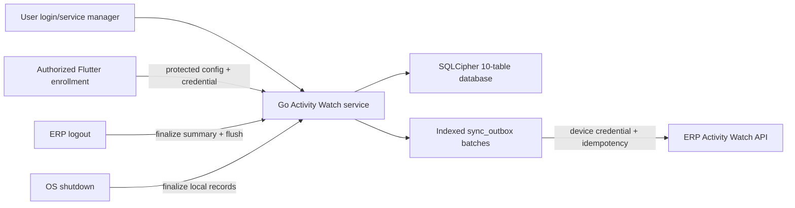
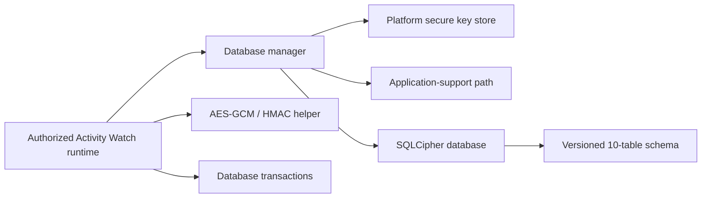

# Architecture

## Activity Watch/manual attendance and payroll snapshots

ERP authentication does not write attendance. The paired Go agent sends a
minimal device-authenticated attendance event independently of the detailed
logout-only outbox. Device middleware resolves the employee; the backend
converts the UTC event to company-local time and insert-ignores a row protected
by `(employee_id, attendance_date)` uniqueness. Manual attendance is preserved
and remains available for employees without computers. The agent persists
unsent first check-ins locally and retries them after network or service
recovery.

Monthly attendance reuses the same `attendance_records` ledger. The Attendance
screen renders the all-employee response as a read-only monthly report filtered
to employees with persisted rows; a cell exists only when the ledger contains
that employee/date. Existing cells reuse the single-record attendance detail
and editor flow. Employee report metadata (department and active employment
status) travels in the same monthly response, so the grid does not issue
per-row lookups. The report paginates the already bounded monthly employee set
client-side after filter indexing. The report query includes inactive or
terminated employees eligible during the selected period, while write queries
remain active-only. The separate Bulk Attendance variation scopes the same API to
non-system employees and submits at most 15,000 employee/date decisions to
`POST /hr/attendance-monthly-sheet` without per-cell network calls. The backend revalidates company, user-link,
employment-period, weekly-off, future-date, and unique-key rules before one
transaction. A separately edited Activity Watch day is updated to a manual HR
decision, retaining its check timestamps; subsequent agent events preserve
that manual decision. Manual monthly rows store `draft` or
`submitted` state in the same ledger; payroll stops before calculation when a
selected period has unsubmitted manual drafts.
The monthly route remains registered for permission and refresh handling but is
hidden from drawer rendering; the Attendance register opens it through its
authorized Bulk Attendance page action.

Payroll processing locks the draft run, bulk-loads attendance and approved LOP
requests, and converts them into decimal scheduled/payable units. Existing
salary, statutory, payslip, accounting, permission, register, and dialog
components are reused. Run and line JSON snapshots preserve the selected policy,
structure, components, statutory result, and earned values. Payslips prefer the
snapshot and use current salary settings only for legacy rows.

The period algorithm is `O(E + A + L + D)` for employees, attendance, leave,
and bounded dates. Employee/date maps avoid repeated database queries and
duplicate counting.

## Activity Watch viewer scope

The Flutter Activity Watch page resolves the session's super-admin flag and
current company before loading reports. Only super administrators send explicit
`scope=company` and, when available, `company_id` query parameters to both
endpoints. The backend remains the authorization boundary and applies the
selected-company restriction. Every non-super-admin request remains restricted
by device owner.
Company summary pagination is consumed in 100-row batches. Summary ownership
uses a linked employee where available and otherwise a distinct user fallback,
so employee filters and labels do not collapse legacy devices into one name.

## Activity Watch self-service pairing

```mermaid
sequenceDiagram
    participant Employee as "Employee in ERP Web"
    participant API as "ERP pairing API"
    participant File as ".billingawpair file"
    participant Agent as "Installed Go agent"
    Employee->>API: Create pairing session (auth + consent)
    API-->>Employee: 10-minute token + pairing URL
    Employee->>File: Download versioned bundle
    Employee->>Agent: Open bundle through OS file association
    Agent->>Agent: Provision encrypted storage if absent
    Agent->>API: Token + locally generated credential
    API->>API: Lock device row; hash credential
    API-->>Agent: Device ID + batch URL
    Agent->>Agent: Protected writes; enable and restart service
```

Pairing state reuses `activity_watch_devices`; no fourth Activity Watch table is
introduced. Token lookup uses a unique hash and transactional row lock. The
browser handles only the short-lived token. Per-platform signed installers
register the pairing file and bootstrap a disabled service that cannot collect
until pairing succeeds.

On Windows, the installed launcher handles `.billingawpair` files. It invokes
the installed Go agent without a console window and displays either successful
connection or a safe pairing failure, without exposing a token or credential.
If Windows denies creation of the user Scheduled Task after a successful
exchange, the paired configuration remains valid and the launcher reports the
separate startup limitation. An installer update starts the replaced agent
immediately when an existing paired configuration is present.

## Activity Watch desktop runtime

The implemented desktop runtime is a Go user-service executable under
`activity-watch-agent`. It is managed in the enrolled user's login context by
Windows, launchd, or the Linux service manager and remains independent of the
Flutter application's lifecycle while that OS session exists. On Windows, the
release builder embeds this Go binary and the per-user installation script in a
small .NET Framework launcher so employees receive one executable without an
IExpress/MakeCAB dependency.



### Runtime responsibilities

- Service host: install/start/stop integration and bounded lifecycle callbacks.
- Worker: coordinate collection, the ERP-logout outbox flush, and graceful
  shutdown. It does not upload on a timer, agent start, summary revision, or
  shutdown.
- Store: apply the SQLCipher key first, verify cipher/schema, and transact each
  approved lifecycle event with its pending outbox record. It is the business
  writer and uses the tested encrypted WAL configuration; helpers must not
  open the database directly.
- Collector: use bounded OS commands/APIs to return idle duration, lock state,
  foreground executable identity/category, foreground browser title,
  process/service names, and content-free keyboard/pointer activity signals.
  Missing capabilities return empty/zero observations. No input value, click,
  coordinate, URL, screenshot, clipboard, or page content crosses this boundary.
  High-frequency Windows activity probes call User32/Kernel32 directly so a
  sample does not depend on PowerShell startup or script timing. Windows
  process inventory uses a native Toolhelp process snapshot and records only
  executable names. Lower-frequency Windows service and USB inventory commands
  use encoded UTF-16LE PowerShell transport; this is transport protection, not
  encryption of collected data.
- Store/aggregator: consolidate state/application/input samples, encrypt browser
  titles and inventory payloads, produce bounded daily title/process projections,
  generate revisioned summaries, and purge synchronized data after 90 days.
- Syncer: select bounded indexed batches, upload encrypted payloads plus their
  approved reporting projection, acknowledge successes, and schedule retries.
- Secret provider: supply database and device credentials without placing them
  in configuration or logs.
- Provisioner: generate and publish a new encrypted database/key pair only
  when both configured targets are absent. It builds files under protected
  temporary names and uses no-replace publication to avoid overwriting data.
- Flutter service control: retain only installed executable/configuration paths
  in secure storage and issue a bounded `signal-logout` command during native
  ERP logout. Failure never blocks normal ERP session clearing.

### Recovery and intervention

- An unexpected worker failure exits non-zero so the configured service-manager
  restart policy can recover pending outbox records from SQLCipher.
- Retryable failures retain data and use capped backoff.
- Revoked/invalid device credentials require re-enrollment. Authentication-only
  permanent failures are requeued when the service restarts with a new device
  credential.
- Missing consent, key, or compatible schema prevents collection.
- Server ingestion validates ciphertext/checksums and stores only approved
  summary metadata for authenticated, user/company-scoped reports.

## Existing Flutter application

`billing-flutter` is a route-first Flutter ERP client for web, mobile, and
desktop. Screens live under `lib/view`, controllers under `lib/controller`,
typed data under `lib/model`, API services under `lib/service`, and shared
infrastructure under `lib/core`. It communicates with the sibling Lumen API
under `/api/v1` and stores normal ERP session state separately.

### Payroll-run lifecycle actions

The payroll-run detail dialog reuses `HrService.deletePayrollRun` for eligible
draft and processed records. The backend enforces lifecycle and voucher checks;
on deletion, database foreign keys cascade from the run to payroll lines and
their payslips. Processed runs deliberately expose only this delete action;
posted runs remain undeletable and are not offered a client action.

The same dialog catches `ApiException` from the Process action. A backend
validation rejection, such as a salary-component reconciliation mismatch,
remains a draft-run state: the dialog stays open and displays the API message.
Only a successful process closes the dialog and refreshes the register.

### Payslip salary totals

The print-template normalization path retains configured earnings and deduction
tables, then adds a presentation-only Gross Salary, Total Deductions, and Net
Salary fallback when an older saved `hr_payslip` layout has no salary-summary
binding. The values are already provided in `salary_summary`; the fallback
does not alter payroll calculations or persisted template data.

### HR salary-component order propagation

The Employee Salary Components tab sends the selected employee and salary
structure to the authenticated HR API only after confirmation. The API derives
the component-name order from that saved structure, updates the explicit
`sort_order` field of matching salary components belonging to employees in the
same company, and returns the number of affected structures and components.
Unmatched target components retain their relative order after matched rows.
Employee and payroll relations load components by `sort_order`, then `id` for
legacy zero-order rows. Payroll lines and payslips are separate persisted
records and are deliberately not read or mutated by this operation.

### Party-code editing flow

The Parties page owns the remote lookup required to find codes already used by
the target prefix across all party types, matching the database's global
`party_code` unique key. Pure lookup-filter, prefix, next-number, original-type
restoration, and async-refresh validation rules live in
`helper/party_code_helper.dart` so they can be tested without constructing the
full page. A monotonically increasing request token on the page prevents an
older type lookup from overwriting the code for a newer selection. The backend
remains responsible for final global uniqueness validation when the party is
saved. Selecting an existing party also compares its generated-code prefix
with its saved type and prepares a corrected value when legacy data is
inconsistent.

## Activity Watch local persistence

Activity Watch persistence is an opt-in native subsystem under
`lib/core/activity_watch`. Normal application startup does not open the
database. An enrollment/consent workflow must explicitly construct the manager
and request a database context.



### Component responsibilities

- Key store: generate or load three independent 256-bit keys without exposing
  them to logs or configuration files.
- Database path provider: choose a private application-support directory.
- Database manager: reject web, load keys, open SQLCipher, and return a
  lifecycle context.
- Database connection: apply the key first, verify SQLCipher, configure
  durability/privacy pragmas, create/migrate schema, and expose transactions.
- Payload cipher: encrypt/decrypt sensitive BLOB values with AES-256-GCM and
  generate keyed identifier HMACs.
- Context: own the connection and key buffers and dispose them together.

### Failure and recovery

- SQLCipher or secure-store unavailability fails closed.
- Schema creation/migration is transactional.
- A database with a newer schema version is not opened.
- Wrong-key and integrity failures occur before business writes.
- Caller transactions roll back on exceptions.
- Full activity segment crash repair belongs to the later collection layer.

### Human intervention

- Enrollment and consent are required before initialization.
- Lost secure-store keys require device re-enrollment; local encrypted data is
  intentionally unrecoverable.
- Platform permission denial is handled by later capability adapters and must
  be shown to the employee/administrator.
## Activity Watch USB metadata flow

Consent-v3 Windows agents poll USB topology and removable-drive metadata once
per minute; macOS agents poll USB device topology through `system_profiler`.
The collector keeps a bounded in-memory snapshot and emits only differences
after the first baseline scan. Windows retains bounded removable-drive file
change observations; macOS reports device metadata only because drive file
enumeration would require broader filesystem access. The store encrypts each
`usb-observation` in the existing `system_events` metadata columns and queues
it for the next ERP-logout upload. Daily-summary aggregation decrypts the local
events, keeps at most 50 devices and 200 most-recent Windows file changes, and
exposes those bounded fields through the existing summary endpoint and expanded
Flutter details. No file is opened or hashed. Windows scanning is O(D + F) time
and O(D + F) memory, where F is capped at 5,000 files per scan; macOS device
parsing is O(D) in discovered USB nodes.

The Windows collector sends the multi-statement USB query using PowerShell's
UTF-16LE `EncodedCommand` contract. This preserves nested WMI filter quotes
across Windows process argument reconstruction; it does not encrypt or conceal
the script and does not change the collected data boundary. Its bounded generic
file list is materialized with `ToArray()` before JSON projection to avoid the
Windows PowerShell 5.1 dynamic-binder failure for generic collections.
