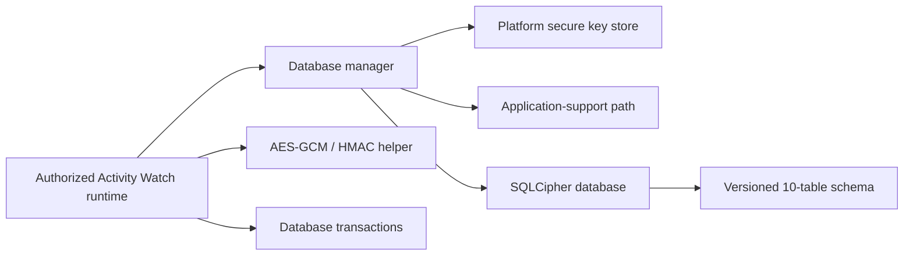

# Architecture

## Existing Flutter application

`billing-flutter` is a route-first Flutter ERP client for web, mobile, and
desktop. Screens live under `lib/view`, controllers under `lib/controller`,
typed data under `lib/model`, API services under `lib/service`, and shared
infrastructure under `lib/core`. It communicates with the sibling Lumen API
under `/api/v1` and stores normal ERP session state separately.

## Activity Watch local persistence

Activity Watch persistence is an opt-in native subsystem under
`lib/core/activity_watch`. Normal application startup does not open the
database. An enrollment/consent workflow must explicitly construct the manager
and request a database context.

### Component responsibilities

- Key store: generate or load three independent 256-bit keys without exposing
  them to logs or configuration files.
- Database path provider: choose a private application-support directory.
- Database manager: reject web, load keys, open SQLCipher, and return a
  lifecycle context.
- Database connection: apply the key first, verify SQLCipher, configure
  durability/privacy pragmas, create/migrate schema, and expose transactions.
- Payload cipher: encrypt/decrypt sensitive BLOB values with AES-256-GCM and
  generate keyed identifier HMACs.
- Context: own the connection and key buffers and dispose them together.

### Failure and recovery

- SQLCipher or secure-store unavailability fails closed.
- Schema creation/migration is transactional.
- A database with a newer schema version is not opened.
- Wrong-key and integrity failures occur before business writes.
- Caller transactions roll back on exceptions.
- Full activity segment crash repair belongs to the later collection layer.

### Human intervention

- Enrollment and consent are required before initialization.
- Lost secure-store keys require device re-enrollment; local encrypted data is
  intentionally unrecoverable.
- Platform permission denial is handled by later capability adapters and must
  be shown to the employee/administrator.

