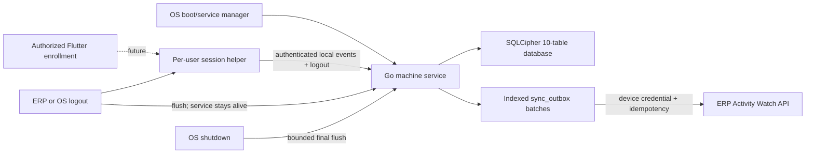
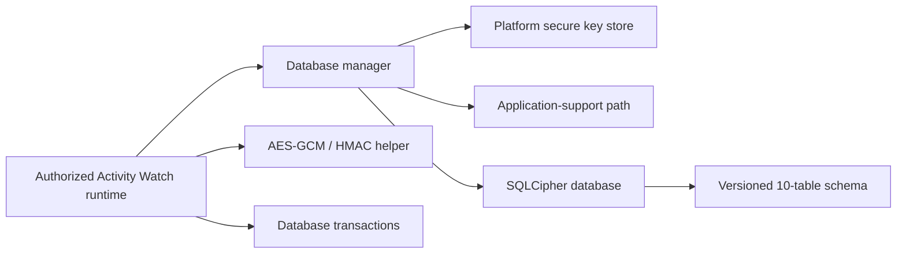

# Architecture

## Activity Watch desktop runtime

The implemented desktop runtime is a Go machine-service executable under
`activity-watch-agent`. Its architecture reserves a future interactive
session-helper role in the same executable, but that role and its native
collectors are not implemented yet. The machine role is managed by Windows
Services, launchd, or the Linux service manager and is independent of the
Flutter application's lifecycle.

### Runtime responsibilities

- Service host: install/start/stop integration and bounded lifecycle callbacks.
- Worker: coordinate collection, immediate flush requests, periodic sync, and
  graceful shutdown.
- Store: apply the SQLCipher key first, verify cipher/schema, and transact
  lifecycle events and outbox state. It is the business writer and uses the
  tested encrypted WAL configuration; helpers must not open the database
  directly.
- Collector: emit only approved machine lifecycle/health observations in the
  initial phase; native interactive collectors remain behind interfaces.
- Syncer: select bounded indexed batches, upload opaque encrypted payloads,
  acknowledge successes, and schedule retries.
- Secret provider: supply database and device credentials without placing them
  in configuration or logs.
- Flutter service control: retain only installed executable/configuration paths
  in secure storage and issue a bounded `signal-logout` command during native
  ERP logout. Failure never blocks normal ERP session clearing.

### Recovery and intervention

- An unexpected worker failure exits non-zero so the configured service-manager
  restart policy can recover pending outbox records from SQLCipher.
- Retryable failures retain data and use capped backoff.
- Revoked/invalid device credentials require administrator re-enrollment.
- Missing consent, key, or compatible schema prevents collection.
- Because the ERP ingestion endpoint is not implemented, production upload
  remains disabled until backend enrollment and ingestion are available.

## Existing Flutter application

`billing-flutter` is a route-first Flutter ERP client for web, mobile, and
desktop. Screens live under `lib/view`, controllers under `lib/controller`,
typed data under `lib/model`, API services under `lib/service`, and shared
infrastructure under `lib/core`. It communicates with the sibling Lumen API
under `/api/v1` and stores normal ERP session state separately.

### Party-code editing flow

The Parties page owns the remote lookup required to find codes already used by
a selected party type. Pure prefix, next-number, original-type restoration,
and async-refresh validation rules live in `helper/party_code_helper.dart` so
they can be tested without constructing the full page. A monotonically
increasing request token on the page prevents an older type lookup from
overwriting the code for a newer selection. The backend remains responsible
for final global uniqueness validation when the party is saved. Selecting an
existing party also compares its generated-code prefix with its saved type and
prepares a corrected value when legacy data is inconsistent.

## Activity Watch local persistence

Activity Watch persistence is an opt-in native subsystem under
`lib/core/activity_watch`. Normal application startup does not open the
database. An enrollment/consent workflow must explicitly construct the manager
and request a database context.

### Component responsibilities

- Key store: generate or load three independent 256-bit keys without exposing
  them to logs or configuration files.
- Database path provider: choose a private application-support directory.
- Database manager: reject web, load keys, open SQLCipher, and return a
  lifecycle context.
- Database connection: apply the key first, verify SQLCipher, configure
  durability/privacy pragmas, create/migrate schema, and expose transactions.
- Payload cipher: encrypt/decrypt sensitive BLOB values with AES-256-GCM and
  generate keyed identifier HMACs.
- Context: own the connection and key buffers and dispose them together.

### Failure and recovery

- SQLCipher or secure-store unavailability fails closed.
- Schema creation/migration is transactional.
- A database with a newer schema version is not opened.
- Wrong-key and integrity failures occur before business writes.
- Caller transactions roll back on exceptions.
- Full activity segment crash repair belongs to the later collection layer.

### Human intervention

- Enrollment and consent are required before initialization.
- Lost secure-store keys require device re-enrollment; local encrypted data is
  intentionally unrecoverable.
- Platform permission denial is handled by later capability adapters and must
  be shown to the employee/administrator.
