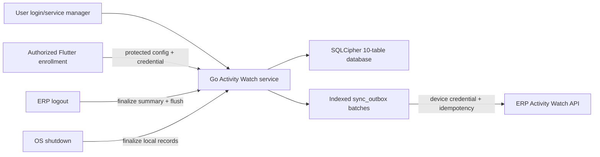
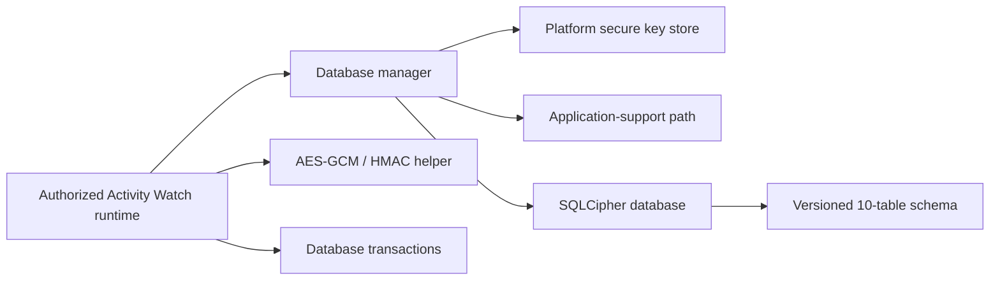

# Architecture

## 2026-09-05 — Project overview and detail workspace

`ProjectOverviewPage` is the Project module landing workspace: it reuses the
existing display-only `ProjectKanbanBoard`, controller search state, and shared
status badge/progress components. Cross-project metrics remain owned by the
dashboard, so the Projects page avoids duplicate aggregate calculation,
presentation, and status-filter controls.

Project cards now follow the existing Task Kanban card hierarchy and reuse
the same shared `AppStatusBadge` and `AppProgressBar` components. Only
Project-specific data binding differs (billing method, project status, and
customer footer); no second card design system is introduced.

The responsive Project grid uses the same status-color alpha, border, radius,
and padding values as the existing Kanban lanes. It performs one linear build
over the already-loaded Projects collection.

`ProjectOverviewPage` reuses `AppRegisterFilters` and the shared Project
filter-option constants also used by `ProjectManagementPage`. Filter state stays
in `ProjectManagementController`, where the existing filter/search pipeline
performs bounded linear passes over the loaded authorized Projects.

The existing Project API already includes each task’s authorized primary
employee relation. `ProjectManagementController` builds a
project-id-to-assignee-name map from that response once per Project load.
Assignment IDs are deduplicated with a `Set`, making map construction linear in
loaded task assignments; card rendering only reads its precomputed list and
does not make an HR request.

`ProjectDetailPage` is resolved by the app shell from `/projects/:id/detail`.
It is a single scrollable workspace: a compact Project name-and-metadata header
is followed by expandable Tasks, Milestones, Timeline, Billing, and Vendor
Works sections. Dashboard-style task, completion, milestone, and budget
summaries are intentionally not duplicated there.
The sections begin expanded and preserve their child state when collapsed, so
opening a section again does not recreate its table or controller. Each child
register receives the selected project id and its existing scoped controller.
The summary and timeline are read-only projections of the same model data, so
existing editor and child-register mutation paths remain authoritative.

The detail page opts into each register page's constrained table view. This
reuses `PurchaseRegisterPage` for desktop table rows and its existing mobile
card fallback. Task and milestone column definitions remain feature-local;
Billing and Vendor Works reuse their existing register columns. Selecting any
row retains the established editor dialog/navigation path.
Inline filter panels are suppressed only for these embedded detail tables, so
the parent workspace stays focused while standalone registers retain filtering.
For embedded detail tables, `PurchaseRegisterPage.contentSized` removes its
inner vertical viewport and lets the Project Detail scroll view size each
section to its paginated visible content. Standalone pages retain their own
scroll controller and fixed viewport behavior.

The legacy `/projects` entry resolves to `ProjectOverviewPage`; the explicit
`new=1` query keeps the existing `ProjectManagementPage` creation workflow
available without duplicating its editor logic.

## 2026-09-05 — Reusable document binding picker and uniform print data builder

`DocumentBindingPicker` (`lib/components/printing/document_binding_picker.dart`)
is a new focused `StatefulWidget` that groups the flat list of print-template
binding keys (produced by `availablePrintBindings`) into five labelled sections:
Document, Party, Totals, GST, and Custom. A toggleable search field filters chips
in real time with an O(n) linear pass over the bounded key list (~25–35 items).
The widget replaced the inline `Wrap` + `ActionChip` block in
`DocumentDesignerShapeInspector`, removing ~20 lines of duplicated code. Its
`onSelected` callback carries only the raw key; insertion logic remains in the
caller. The widget can be reused wherever a binding picker is needed (e.g.
email template dialogs).

`salesInvoicePrintData()` in `SalesInvoiceManagementController` now delegates
to `buildManagedDocumentPrintData()`, matching the pattern of all other nine
document controllers (Sales Order, Quotation, Proforma Invoice, Delivery,
Receipt, Purchase Invoice, Order, Receipt, Payment). Five `extraData` keys that
`buildManagedDocumentPrintData` derives from `gstBreakup` are no longer
duplicated by the caller (`cgst_amount`, `sgst_amount`, `igst_amount`,
`cess_amount`, `taxable_total_amount`). All invoice-specific keys are preserved:
CGST/SGST/IGST summary labels and currency symbols, discount and round-off
summary labels and currencies, `discount_amount`, `round_off_amount`,
`adjustment_amount`, `is_direct_customer`, and `watermark_text`.

## 2026-09-05 — Proforma print binding parity

Sales Proforma Invoice reuses the shared `DocumentPrintDataModel` and managed
print preview pipeline. Its controller now supplies the same common extra-data
binding contract as Sales Invoice and enriches each line with the shared
discount fields. Proforma-specific business rules remain in its own tax and
round-off calculation path.

## 2026-09-04 — Shared dynamic form labels

`AppFormTextField` and `ErpLinkField` obtain their visual labels from the
focused `buildFormLabel` utility. The utility strips legacy optional suffixes
and composes the cleaned label with an optional red required marker. Wrapper
components forward `isRequired` so label presentation is centralized without
changing validation or requiring caller-wide edits.

## 2026-09-04 — Sales Quotation and Proforma editor state

Quotation and Proforma controllers use the shared `LatestRequestGuard` to
version editor-changing requests. New/reset, document selection, CRM bootstrap,
and quotation prefill invalidate older responses, so only the latest intent may
write controllers, line drafts, form keys, or Sales-chain state. Each check is
O(1) and no request history is retained.

The Proforma Source Quotation field is optional. When selected, the existing
prefill and source-line contract remains active; when cleared, quotation-line
identifiers are removed from the draft. Manual round-off edits refresh totals
without invoking automatic round-off synchronization, while line changes and
the Apply round off switch retain automatic behavior.

## 2026-09-04 — Project Head task visibility

The Project session endpoint and `ProjectTask::visibleToUser` use the same
`project_head.access` permission. Project list eager loading, task management,
task dashboard summaries, and task update/delete lookups all reuse that shared
scope, so Project Heads receive complete task status data while regular users
retain assignment-only visibility. The check is O(1) per query construction;
database filtering and pagination remain unchanged.

## 2026-09-04 — Shared AppDialog shell

`AppDialog` is the shared presentation shell for centered modal content. It
owns responsive insets, themed surface decoration, title/close header, divider,
scrolling content, keyboard inset handling, and optional sticky actions. The
existing `showAppFilterPanel` API remains the call-site adapter, so current
filter and Project task editor callers require no dialog orchestration changes.
Confirmation and specialized dialogs continue using their existing widgets
until they need the same shell behavior.

## 2026-09-04 — Project task priority

`project_tasks.priority` is a required database enum with a `medium` default.
The Laravel model and task validation expose the same lowercase values to the
typed Flutter model. The task controller owns editor state and includes it in
both create and update payloads.

The existing shared `AppStatusBadge` renders priority in constrained task
tiles and reusable Kanban task cards. The four-value switch helpers perform
O(1) label/color lookup per displayed task; no new collection or extra scan is
introduced, and no priority filter/sort state is added.

## Project status label wording

Project presentation code maps the persisted `on_hold` status to the
user-facing label “In Review”. Status values and API payloads remain unchanged;
the mapping is applied only at dropdown, filter, Kanban, and dashboard label
boundaries.

## Project register readability

Project Billing, Expenses, Resource Usage, and Timesheets reuse
`normalizeDateValue` at their list and constrained-tile presentation points,
so stored dates remain unchanged while API timestamps render in the active
company date format. Billing, Expenses, and Timesheets configure their existing
`PurchaseRegisterColumn` instances with adjacent amount/billable/status padding
and wider status flex values (including Vendor Work, which has no date column);
the correction remains local to Project pages
instead of changing every shared register table. Rendering continues to be one
O(n) pass over already-filtered, paginated rows with O(1) work and storage per
displayed cell.

Project amount cells use the shared `formatAmount` formatter, which reads the
active company grouping and decimal-place settings; `PurchaseRegisterColumn`
alignment keeps those formatted values flush right without changing stored
amounts.

All five Project child controllers invalidate `ProjectModuleRefreshController`
before reloading after create/update/delete. This preserves the existing shared
project cache for normal reads while ensuring child mutations fetch the
authoritative nested collection immediately; reload work remains bounded by the
project API response size.

## Sales customer advance allocation

`SalesReceiptManagementController` keeps Received Amount as the independent
control total. Allocation rows are optional; only invoice-linked rows reduce
the displayed customer advance. The editor uses `SalesService` for an explicit
FIFO preview and appends those rows only after Auto Allocate is clicked. A
posted receipt keeps its persisted rows read-only while new rows may be added
against its remaining advance. Per-line invoice options account for other
editable rows, so the same invoice remains selectable only while it has usable
outstanding balance.

The API remains authoritative. `SalesReceiptService` validates the aggregate
of duplicate invoice rows, persists only submitted rows, posts the receipt
voucher without inferring allocations, and provides a transactional endpoint
for allocating remaining advance. `SalesCustomerFifoAllocationService` owns
invoice-side FIFO matching: after explicit user approval, it locks the customer
and eligible receipt/invoice rows, consumes receipts by `receipt_date, id`, and
applies them only to the invoice currently being posted. Voucher allocations,
invoice settlement, receipt status/unallocated amount, on-account references,
and audit metadata are updated inside the posting transaction.

The receipt preview scans the selected customer's outstanding invoices once,
and invoice-side matching scans available receipts once: O(i) and O(r)
respectively, with bounded allocation output. Direct customers and historical
data are excluded from cross-document matching. The additive audit columns and
indexes are documented in
`billing-api/doc/sales-customer-advance-allocation.md`.

Sales invoice settlement distinguishes the economic source of each posted
voucher allocation. Receipt and advance-setoff allocations feed the persisted
`paid_amount`; receipt, return-credit, and other valid adjustments together
feed `balance_amount`. Returned quantities determine Returned and Partially
returned status before payment/overdue status is considered. Sales return
posting locks the linked invoice and caps its voucher allocation at the current
outstanding amount, leaving excess credit on the return voucher as on-account
customer credit. Historical repair is an explicit console operation and does
not modify journal totals or account balances.

## Purchase Receipt print and Email PDF

`PurchaseReceiptManagementController` now follows the established Purchase
Order/Invoice print flow: it builds `purchase_receipt` print data, opens the
shared designer, and sends through the shared template-selected document-email
service. Its print builder creates one item-id map, then processes receipt
lines once, for O(i + n) time and O(i + n) output space for i loaded items and
n receipt lines. The Receipt register uses the existing temporary-controller
Email PDF button with `editorOnly` initialization, so loading the selected
receipt does not refresh the background register.

## Resolved Email PDF template previews

The shared Email PDF template selector receives the current
`DocumentPrintDataModel` from direct-send payloads and print-designer preview
sends. It reuses `resolvePrintTemplateText` with a small O(1)-sized alias map
that aligns canonical print fields with the backend email context
(`document_no`, `grand_total`, and document-number aliases). The dialog is
display-only; the backend still resolves and stores the final sent message.
Batch payslip sending deliberately supplies no preview document because a
single selected payslip does not exist before template selection.

## Deferred shared-widget hover state

`ErpLineItemTable`, the `ErpModuleDashboard` trend card, and the private
Activity Watch duration graph keep the latest requested hover value in local
O(1) state and schedule one post-frame callback. The callback checks `mounted`
and applies a rebuild only when the rendered hover value differs. Each widget
keeps this small feature-local adapter because its state shape differs (row
index, graph index, or graph index plus anchor); no shared data/API component
is introduced.

## Register Email PDF actions

Sales and Purchase registers share module-local Email PDF button and controller
loader helpers. The button owns only per-row progress and error feedback; the
generic loader creates a tagged, short-lived existing management controller,
reloads the selected persisted document, rechecks eligibility, calls that
controller's shared printable-email method, and deletes it afterward. Each
document controller remains responsible for its own print data and
customer/supplier context, while the shared printable-email service remains
the sole template, recipient, delivery, and history flow. This avoids parallel
email APIs and duplicate per-document register logic.

## Sales detail action rows

Sales detail editors use the shared `SalesDocumentActionRow` twice when a
document has a conversion/payment action: the first row follows the pipeline
and status summary, while the final row contains lifecycle and viewing actions.
Action visibility remains owned by each management controller's existing
status and relationship guards.

## Sales lifecycle status presentation

The shared `sales_support.dart` helpers map canonical Sales statuses to
document-specific next-action labels and semantic colors. Registers, document
list panes, headers, and `CrmSalesPipelineBar` all call these helpers; they do
not write or reinterpret lifecycle state. Quotation and delivery read APIs
provide relationship existence flags through Eloquent `withExists`, keeping
list/detail conversion decisions consistent without N+1 queries.

## CRM enquiry quotation bootstrap

`SalesQuotationManagementController.applyOpportunityBootstrap` reads the typed
`CrmOpportunityModel` fields returned by the CRM opportunity endpoint. It
copies the company and customer identifiers to the new quotation state, keeps
the `crm_opportunity_id` for persistence, and adds an empty-only linkage note.
If the linked party is absent from the initial Sales lookup, the quotation
controller adds the fetched party to its local customer options and refreshes
the editor after the detail request completes.
This avoids relying on an unmodelled nested enquiry object while preserving the
existing CRM sales-chain API and editable quotation form.

## Global status toast

`AppToast` owns one overlay entry above the active navigator and replaces it
before displaying a new message. The application root uses Flutter's standard
`ScaffoldMessenger`; toast behavior remains a separate overlay service so hot
restart cannot retain an unsupported custom messenger/inherited-widget state.

## CRM expected-value display formatting

`formatCrmExpectedValue` is the single presentation helper shared by the CRM
opportunity controller and register page. It parses a bounded scalar input in
O(1) time and O(1) space, maps absent or numeric-zero values to the `-`
placeholder, and otherwise preserves the API text. This is display-only: typed
models, API payloads, filtering, storage, and monetary calculations are not
changed. The existing `PurchaseRegisterColumn` remains the register component;
the Expected Value column uses its built-in centered alignment and an
appropriate flex allocation. The legacy read-only table uses the same centered
text alignment.

## CRM register filter presentation

CRM register pages reuse the Sales register's toggleable `PurchaseRegisterPage`
filter slot for inline search, date, and status controls. CRM Enquiries keeps
its existing SettingsWorkspace list/editor flow and renders the equivalent bar
inside the list pane. CRM Follow-ups keeps its timeline layout and renders its
From Date and To Date controls only when the same Filter action is active. Existing controller- or
page-owned filter state remains the source of truth; text-controller listeners
update the filtered rows locally.

The Enquiries Followups editor treats completed followup drafts as historical
presentation data. It hides completed cards and promotes a completed draft's
non-empty `next_followup` value to an editable followup card with a pending
badge; the card edits the existing draft's next-date, assignee, and notes while
draft serialization remains compatible and derives `done` from a
non-empty next-date input. The editor does not expose a manual status control.

## Browser session restoration

The existing shared-preference session store remains the single source of truth
for a browser refresh. App bootstrap restores any unexpired token, then keeps
the existing background `/auth/me` validation; only manual logout, expiry, or a
401/403 response clears the session. The legacy remember-me preference remains
cleared on logout for compatibility but no longer controls restoration.

## Activity Watch/manual attendance and payroll snapshots

ERP authentication does not write attendance. The paired Go agent sends a
minimal device-authenticated attendance event independently of the detailed
logout-only outbox. Device middleware resolves the employee; the backend
converts the UTC event to company-local time and insert-ignores a row protected
by `(employee_id, attendance_date)` uniqueness. Manual attendance is preserved
and remains available for employees without computers. The agent persists
unsent first check-ins locally and retries them after network or service
recovery.

Monthly attendance reuses the same `attendance_records` ledger. The Attendance
screen renders the all-employee response as a read-only monthly report filtered
to employees with persisted rows; a cell exists only when the ledger contains
that employee/date. Existing cells reuse the single-record attendance detail
and editor flow. Employee report metadata (department and active employment
status) travels in the same monthly response, so the grid does not issue
per-row lookups. The report paginates the already bounded monthly employee set
client-side after filter indexing. The report query includes inactive or
terminated employees eligible during the selected period, while write queries
remain active-only. The separate Bulk Attendance variation scopes the same API to
non-system employees and submits at most 15,000 employee/date decisions to
`POST /hr/attendance-monthly-sheet` without per-cell network calls. The backend revalidates company, user-link,
employment-period, weekly-off, future-date, and unique-key rules before one
transaction. A separately edited Activity Watch day is updated to a manual HR
decision, retaining its check timestamps; subsequent agent events preserve
that manual decision. Manual monthly rows store `draft` or
`submitted` state in the same ledger; payroll stops before calculation when a
selected period has unsubmitted manual drafts.
The monthly route remains registered for permission and refresh handling but is
hidden from drawer rendering; the Attendance register opens it through its
authorized Bulk Attendance page action.

Payroll processing locks the draft run, bulk-loads attendance and approved LOP
requests, and converts them into decimal scheduled/payable units. Existing
salary, statutory, payslip, accounting, permission, register, and dialog
components are reused. Run and line JSON snapshots preserve the selected policy,
structure, components, statutory result, and earned values. Payslips prefer the
snapshot and use current salary settings only for legacy rows.

Company Settings stores the LOP calculation basis and percentage on the company
record. The same record now holds an optional fixed divisor, component versus
contractual-net method, contractual-net rounding mode, and weekly-off policy.
Calendar/fixed modes derive payable and unpaid calendar units in one bounded
date pass; fixed mode subtracts unpaid units using its configured divisor,
working-day mode uses scheduled paid units, and percentage mode applies its
configured per-LOP factor. A synthetic net-salary adjustment is snapshotted
only for contractual-net reconciliation. The selected policies, actual divisor,
working/calendar paid units, and calculated amounts are retained in the payroll
snapshot. Existing effective-dated statutory profiles supply the PF/ESI ceilings
to special salary-component formulas, avoiding another configuration table.

The period algorithm is `O(E + A + L + D)` for employees, attendance, leave,
and bounded dates. Employee/date maps avoid repeated database queries and
duplicate counting; weekly-off qualification is another bounded O(D) pass.

## Activity Watch viewer scope

The Flutter Activity Watch page resolves the session's super-admin flag and
current company before loading reports. Only super administrators send explicit
`scope=company` and, when available, `company_id` query parameters to both
endpoints. The backend remains the authorization boundary and applies the
selected-company restriction. Every non-super-admin request remains restricted
by device owner.
Company summary pagination is consumed in 100-row batches. Summary ownership
uses a linked employee where available and otherwise a distinct user fallback,
so employee filters and labels do not collapse legacy devices into one name.
The Flutter report first retains the newest API-ordered cumulative snapshot for
each device/date, then uses an owner/date map to combine distinct devices into
one daily card. This is presentation-only, runs in expected linear time over
the bounded response/details, and does not alter API authorization or storage.

## Activity Watch self-service pairing

```mermaid
sequenceDiagram
    participant Employee as "Employee in ERP Web"
    participant API as "ERP pairing API"
    participant File as ".billingawpair file"
    participant Agent as "Installed Go agent"
    Employee->>API: Create pairing session (auth + consent)
    API-->>Employee: 30-minute token + pairing URL
    Employee->>File: Download versioned bundle
    Employee->>Agent: Open bundle through OS file association
    Agent->>Agent: Provision encrypted storage if absent
    Agent->>API: Token + locally generated credential
    API->>API: Lock device row; hash credential
    API-->>Agent: Device ID + batch URL
    Agent->>Agent: Protected writes; enable and restart service
```

Pairing state reuses `activity_watch_devices`; no fourth Activity Watch table is
introduced. Token lookup uses a unique hash and transactional row lock. The
browser handles only the short-lived token. Per-platform signed installers
register the pairing file and bootstrap a disabled service that cannot collect
until pairing succeeds.

On Windows, the installed launcher handles `.billingawpair` files. It invokes
the installed Go agent without a console window and displays either successful
connection or a safe pairing failure, without exposing a token or credential.
If Windows denies creation of the user Scheduled Task after a successful
exchange, the paired configuration remains valid and the launcher reports the
separate startup limitation. A Windows installer update requests elevation,
stops and waits for the existing service/process, replaces the executable, then
restarts the already-installed service (or starts a direct paired process only
when no service exists).

## Activity Watch desktop runtime

The implemented desktop runtime is a Go user-service executable under
`activity-watch-agent`. It is managed in the enrolled user's login context by
Windows, launchd, or the Linux service manager and remains independent of the
Flutter application's lifecycle while that OS session exists. On Windows, the
release builder embeds this Go binary and the per-user installation script in a
small .NET Framework launcher so employees receive one executable without an
IExpress/MakeCAB dependency.



### Runtime responsibilities

- Service host: install/start/stop integration and bounded lifecycle callbacks.
- Worker: coordinate collection, the ERP-logout outbox flush, and graceful
  shutdown. It does not upload on a timer, agent start, summary revision, or
  shutdown.
- Store: apply the SQLCipher key first, verify cipher/schema, and transact each
  approved lifecycle event with its pending outbox record. It is the business
  writer and uses the tested encrypted WAL configuration; helpers must not
  open the database directly.
- Collector: use bounded OS commands/APIs to return idle duration, lock state,
  foreground executable identity/category, foreground browser title,
  process/service names, and content-free keyboard/pointer activity signals.
  Missing capabilities return empty/zero observations. No input value, click,
  coordinate, URL, screenshot, clipboard, or page content crosses this boundary.
  High-frequency Windows activity probes call User32/Kernel32 directly so a
  sample does not depend on PowerShell startup or script timing. Windows
  process inventory uses a native Toolhelp process snapshot and records only
  executable names. Lower-frequency Windows service and USB inventory commands
  use encoded UTF-16LE PowerShell transport; this is transport protection, not
  encryption of collected data.
- Store/aggregator: consolidate state/application/input samples, encrypt browser
  titles and inventory payloads, produce bounded daily title/process projections,
  generate revisioned summaries, and purge synchronized data after 90 days.
- Syncer: select bounded indexed batches, upload encrypted payloads plus their
  approved reporting projection, and schedule retries. A row becomes synced
  only after a bounded JSON success envelope confirms the complete accepted
  count; an HTML/malformed/mismatched HTTP 2xx response remains retryable.
- Server logout control: poll the device-authenticated control flag, drain the
  complete indexed outbox, then send a separate authenticated acknowledgement.
  Separating completion from the final batch handles empty queues and exact
  batch-size multiples. The server retains the flag when upload or
  acknowledgement fails, so the next poll retries safely.
- Secret provider: supply database and device credentials without placing them
  in configuration or logs.
- Provisioner: generate and publish a new encrypted database/key pair only
  when both configured targets are absent. It builds files under protected
  temporary names and uses no-replace publication to avoid overwriting data.
- Flutter service control: retain only installed executable/configuration paths
  in secure storage and issue a bounded `signal-logout` command during native
  ERP logout. Failure never blocks normal ERP session clearing.

### Recovery and intervention

- An unexpected worker failure exits non-zero so the configured service-manager
  restart policy can recover pending outbox records from SQLCipher.
- Retryable failures retain data and use capped backoff.
- Revoked/invalid device credentials require re-enrollment. Authentication-only
  permanent failures are requeued when the service restarts with a new device
  credential.
- Missing consent, key, or compatible schema prevents collection.
- Server ingestion validates ciphertext/checksums and stores only approved
  summary metadata for authenticated, user/company-scoped reports.

## Existing Flutter application

`billing-flutter` is a route-first Flutter ERP client for web, mobile, and
desktop. Screens live under `lib/view`, controllers under `lib/controller`,
typed data under `lib/model`, API services under `lib/service`, and shared
infrastructure under `lib/core`. It communicates with the sibling Lumen API
under `/api/v1` and stores normal ERP session state separately.

Project Billing, Expense, Resource Usage, Timesheet, and Vendor Work editors
follow the Sales editor-route architecture. Register actions create a stable
`/projects/<register>/new` or `/projects/<register>/<id>` path through
`ShellRouteScope`; `AppShellPage` resolves the path to editor-only center
content. The application shell, drawer state, header, and route history remain
mounted.
All modules reuse `openModuleShellRoute` from `page_shell_actions.dart` for
shell-aware navigation; Project pages build their explicit register paths at
the call site.

### Payroll-run lifecycle actions

The payroll-run detail dialog reuses `HrService.deletePayrollRun` for eligible
draft and processed records. The backend enforces lifecycle and voucher checks;
on deletion, database foreign keys cascade from the run to payroll lines and
their payslips. Processed runs deliberately expose only this delete action;
posted runs remain undeletable and are not offered a client action.

The same dialog catches `ApiException` from the Process action. A backend
validation rejection, such as a salary-component reconciliation mismatch,
remains a draft-run state: the dialog stays open and displays the API message.
Only a successful process closes the dialog and refreshes the register.

### Payslip salary totals

The print-template normalization path retains configured earnings and deduction
tables, then adds a presentation-only Gross Salary, Total Deductions, and Net
Salary fallback when an older saved `hr_payslip` layout has no salary-summary
binding. The values are already provided in `salary_summary`; the fallback
does not alter payroll calculations or persisted template data.

### Payslip PDF table borders

The vector PDF renderer in `document_print_designer.dart` reuses the same table
geometry as the preview, but emits salary-table dividers through one
`pw.CustomPaint` stroke grid, including the outer border. This keeps row,
column, and outline borders consistent at fractional PDF coordinates while
retaining the template's configured stroke width and rounded corners. The
change is presentation-only and does not affect payroll data or saved
templates.

### HR salary-component order propagation

The Employee Salary Components tab sends the selected employee and salary
structure to the authenticated HR API only after confirmation. The API derives
the component-name order from that saved structure, updates the explicit
`sort_order` field of matching salary components belonging to employees in the
same company, and returns the number of affected structures and components.
Unmatched target components retain their relative order after matched rows.
Employee and payroll relations load components by `sort_order`, then `id` for
legacy zero-order rows. Payroll lines and payslips are separate persisted
records and are deliberately not read or mutated by this operation.

### Party-code editing flow

The Parties page owns the remote lookup required to find codes already used by
the target prefix across all party types, matching the database's global
`party_code` unique key. Pure lookup-filter, prefix, next-number, original-type
restoration, and async-refresh validation rules live in
`helper/party_code_helper.dart` so they can be tested without constructing the
full page. A monotonically increasing request token on the page prevents an
older type lookup from overwriting the code for a newer selection. The backend
remains responsible for final global uniqueness validation when the party is
saved. Selecting an existing party also compares its generated-code prefix
with its saved type and prepares a corrected value when legacy data is
inconsistent.

## Company leave-policy flow

The shared leave-type catalog defines the available leave categories. Each
company owns one policy row per leave type, so entitlement and accrual rules do
not leak across tenants. Company Settings reads and writes those policies with
the company record.

When a leave request is saved or approved, the API locks the matching policy
inside the request transaction, totals paid days already reserved by pending
and approved requests, and stores the resulting paid/LOP split. Unpaid leave is
always LOP. Payroll reconciles leave-request and attendance LOP, applies the
company multiplier, caps the result at period working days, and stores the raw
LOP and multiplier in the payroll snapshot for auditability.

Legacy `cl_approved_days` remains populated for Casual Leave while all new
calculations use generic `paid_leave_days`. Requests spanning calendar years
are rejected so each year's entitlement is calculated independently.

Leave Types remains the shared catalog-management screen. Leave Request uses
that catalog as a selector only, and Company Settings owns per-company policy
configuration. This keeps request entry free of catalog mutations and prevents
company policy from creating duplicate leave definitions.

## Activity Watch local persistence

Activity Watch persistence is an opt-in native subsystem under
`lib/core/activity_watch`. Normal application startup does not open the
database. An enrollment/consent workflow must explicitly construct the manager
and request a database context.



### Component responsibilities

- Key store: generate or load three independent 256-bit keys without exposing
  them to logs or configuration files.
- Database path provider: choose a private application-support directory.
- Database manager: reject web, load keys, open SQLCipher, and return a
  lifecycle context.
- Database connection: apply the key first, verify SQLCipher, configure
  durability/privacy pragmas, create/migrate schema, and expose transactions.
- Payload cipher: encrypt/decrypt sensitive BLOB values with AES-256-GCM and
  generate keyed identifier HMACs.
- Context: own the connection and key buffers and dispose them together.

### Failure and recovery

- SQLCipher or secure-store unavailability fails closed.
- Schema creation/migration is transactional.
- A database with a newer schema version is not opened.
- Wrong-key and integrity failures occur before business writes.
- Caller transactions roll back on exceptions.
- Full activity segment crash repair belongs to the later collection layer.

### Human intervention

- Enrollment and consent are required before initialization.
- Lost secure-store keys require device re-enrollment; local encrypted data is
  intentionally unrecoverable.
- Platform permission denial is handled by later capability adapters and must
  be shown to the employee/administrator.
## Activity Watch USB metadata flow

Consent-v3 Windows agents poll USB topology and removable-drive metadata once
per minute; macOS agents poll USB device topology through `system_profiler`.
The collector keeps a bounded in-memory snapshot and emits only differences
after the first baseline scan. Windows retains bounded removable-drive file
change observations; macOS reports device metadata only because drive file
enumeration would require broader filesystem access. The store encrypts each
`usb-observation` in the existing `system_events` metadata columns and queues
it for the next ERP-logout upload. Daily-summary aggregation decrypts the local
events, keeps at most 50 devices and 200 most-recent Windows file changes, and
exposes those bounded fields through the existing summary endpoint and expanded
Flutter details. No file is opened or hashed. Windows scanning is O(D + F) time
and O(D + F) memory, where F is capped at 5,000 files per scan; macOS device
parsing is O(D) in discovered USB nodes.

The Windows collector sends the multi-statement USB query using PowerShell's
UTF-16LE `EncodedCommand` contract. This preserves nested WMI filter quotes
across Windows process argument reconstruction; it does not encrypt or conceal
the script and does not change the collected data boundary. Its bounded generic
file list is materialized with `ToArray()` before JSON projection to avoid the
Windows PowerShell 5.1 dynamic-binder failure for generic collections.

## Global theme foundation

`BillingApp` keeps `MaterialApp` as the single global theme boundary. It
registers `AppTheme.light()` and `AppTheme.dark()` and follows
`ThemeMode.system`. `AppTheme` constructs the standard Material `ColorScheme`,
Nunito text scale, and shared component themes for app bars, cards, dialogs,
forms, buttons, selection controls, chips, tables, navigation, menus, tabs,
feedback, progress, expansion, and scrolling.

`AppThemeExtension` remains the ERP compatibility layer used by existing
shared widgets and pages. Both brightness modes always register the complete
extension, including muted, success, warning, information, shell, dashboard,
CRM, and table roles. Existing field names remain stable so module migrations
can replace hardcoded visual values incrementally instead of requiring a
whole-application rewrite.

`AdaptiveShell` is the single application-menu renderer. In light mode it
consumes the white desktop-drawer surface plus dark foreground/muted tokens and
resolves active entries to the global primary color with a primary tint. In
dark mode it retains the existing navy surface and light selected treatment.
This is one O(1) brightness decision at the shared shell boundary; routes,
permissions, hierarchy, expansion state, and menu ordering are unchanged.

Dark presentation uses an explicit semantic layer stack inside
`AppTheme.dark()`: near-neutral scaffold, elevated blue-slate surface, table
header, ordinary/alternating rows, hover, selection, and border/input roles.
The values remain fixed-size theme data and are consumed by the same shared
cards and tables as light mode; no module owns a separate dark palette.

Theme construction processes a fixed palette and fixed component inventory in
O(1) time and O(1) space. Runtime lookups continue through Flutter's inherited
`Theme` mechanism. No API, database, storage, or background component is
involved.

Shared module-list presentation builds on that boundary. `CardThemeData` and
`AppSectionCard` own the one-pixel semantic outline and 12px radius;
`DataTableThemeData` owns standard header, row, divider, spacing, hover, and
selection defaults. `SettingsListCard`, `PurchaseListCard`, and module register
surfaces reuse those primitives rather than maintaining independent table
palettes. `AppThemeExtension.cardDecoration()` provides the same bordered
surface to legacy list wrappers that still use `DecoratedBox`.

Sales and purchase register screens converge on `PurchaseRegisterPage<T>`.
Its desktop table performs one indexed O(n) render pass and resolves header,
uniform ordinary-row, hover, pressed, text, and divider colors from
`AppThemeExtension`. Editable sales, purchase, inventory, manufacturing, and
job-work document lines converge on `ErpLineItemTable`; it consumes the same
semantic roles while retaining its editing controls, validation, calculations,
horizontal overflow, and O(n) row construction. No module-specific table copy
is required for either family.

The non-full-page register gives every persisted `JsonModel` row a stable
document-id key at the list-child boundary. This preserves stateful row actions
such as Email PDF across filtering, sorting, pagination, and reloads; transient
rows use their index only as a fallback. The row's visual alternate-color index
remains presentation-only.

Sales quotation email reuses the client-side document-print generator, sending
the generated PDF as a base64 attachment through the existing backend email
attachment pipeline. Generation is bounded to one selected quotation; the PDF
is held only for that delivery attempt and is not persisted.

Sales Invoice exposes the printable-document email flow from its document
preview, page-header action bar, and register Email PDF column. The header and
register actions share `sendEmailPdfDirectly`; the register action loads its
selected invoice in
a temporary management controller. It shows the shared template selector,
generates the PDF through the existing non-visible print renderer, and sends
it without navigating to the invoice editor or print-preview page. Template
selection, PDF generation, recipient handling, authorization, and
duplicate-send protection remain centralized in the existing shared services.

The shared printable-email dialog also owns the canonical template document
types used by the API. Email Template settings compose those lowercase choices
with document-series choices so Purchase templates can be configured with the
same values used by the sender. Missing-template feedback is derived from the
same registry and names the affected document, rather than relying on a
module-specific error path.

Purchase register actions opt into rethrowing a direct-send failure only after
the shared selector has constructed it. Their local action widget then presents
that exact message in the current register `ScaffoldMessenger`; all other
direct-email callers retain the shared toast behavior.

For a register-triggered Purchase Email PDF operation, the temporary Order,
Invoice, or Payment controller passes `editorOnly: true` through its initial
load and suppresses only its initialization refresh notification. The list
therefore remains mounted to receive the failure snackbar; regular page
initialization, context changes, and saved-document notifications are
unchanged.

The shared printable-email helper classifies absent active templates from its
normalized error text and explicitly uses `AppToastType.warning`. This keeps
the Sales direct-email toast amber like the Purchase register snackbar while
leaving operational failures as `AppToastType.error`.

`LocalPageNavigation`, settings lists, and purchase lists share
`localListTotalPages()`. It uses exact integer ceiling division, runs in O(1)
time and O(1) space, and prevents exact page-size totals from producing a
phantom page. Existing page extraction remains bounded to the visible page.

## CRM follow-up timeline presentation

`CrmFollowupsPage` continues to load the opportunity follow-up board through
`CrmService` and applies the established completed, won/lost, source, and
dashboard-route filters in memory. The presentation layer now renders those
same bounded lists as StaffU-inspired timeline sections: a semantic rail and
node, localized time label, bordered detail surface, status badge, assignee,
notes, and the existing detail-route action.

The optional calendar filter uses the shared `showAppDatePickerDialog` and
normalizes the result to a local calendar day. It filters the already-loaded
route-visible entries in one O(n) pass and does not trigger another API call.
The timeline switches to a stacked time/detail arrangement below 680 logical
pixels, while shared theme roles continue to own every surface, border, text,
and accent color. `CrmService` injection on the page is optional and exists for
deterministic widget verification; production callers retain the default
service construction. Register columns can provide an optional `textStyle`,
keeping shared body typography stable while applying emphasis only where a
specific CRM column or register family needs it. Sales and Purchase registers
opt into the shared row emphasis flag; CRM remains scoped to its lead column.

## Sales outstanding balance parity

`sales_dashboard_support.dart` is the shared boundary for the Sales Dashboard
Outstanding Balance card and its invoice-register drill-down. It classifies an
invoice as outstanding only when its derived status is neither draft nor
cancelled and its persisted `balance_amount` is positive. The dashboard folds
that predicate across the already-loaded invoice collection in O(n) time and
O(1) auxiliary space; the register reuses the same predicate after selecting
the `posted`, `overdue`, and `partially_paid` status set.

The shared route builder opens `/sales/invoices` with `dashboard_filter=open`
and `sort=balance_desc`, matching the explicit query-building pattern used by
Monthly Sales. No additional request, backend endpoint, cache, or persistence
layer is introduced.

## CRM lead probability indicator

`AppProbabilityIndicator` is the shared circular probability visualization used
by the CRM Leads register. It clamps the supplied percentage, selects a semantic
theme color by confidence band, and exposes the percentage through `Semantics`.
The leads page prefers the API's `probability_percent`; for older lead payloads
it maps the existing lead status to a stable fallback locally, so this UI change
does not alter the CRM API or persistence model.

### Excel-compatible statutory salary-component bases

The Employee Salary Components editor and HR API share two additional
`calculation_basis` values. `percent_epf_wage` calculates a percentage on 50%
of whole-rupee earned gross capped at INR 15,000. `percent_basic_da_ceil`
resolves the current `Basic + DA` earning, rounds its base to a whole rupee,
applies the INR 21,000 eligibility ceiling, and rounds the result upward.

Payroll resolves Basic + DA once per employee line and passes that bounded
context to component calculation. This keeps processing linear in the number
of components and avoids database queries or repeated component scans. Saving
a component named PF or ESI is normalized by the API to the approved deduction
basis and rate. Deployment migration updates current component definitions;
persisted payroll lines and payslip snapshots are not mutated.

## 2026-09-03 — Project task board presentation

The standalone Project Tasks route composes a feature-local Kanban board over
`ProjectTaskManagementController.filteredRows`. The controller remains the sole
owner of loading, filtering, selection, validation, and mutations. A small
feature-local board widget performs one O(n) grouping pass into ordered status
lanes and renders cards from typed `ProjectTaskRow` values. The existing shared
theme, section card, filter fields, action button, form controls, modal surface,
and task editor are reused. The embedded Project Tasks subtab deliberately keeps
the existing expandable layout.

Employee display names are indexed once by employee ID after loading, making
card assignee lookup O(1) per ID instead of rescanning the employee list.
Persisted cards are Flutter `Draggable` values and each lane is a typed
`DragTarget`. The controller owns status mutation: it validates the destination,
optimistically replaces the row, blocks another move for the same task ID,
persists the full typed task payload through `ProjectService.updateTask`, then
invalidates `ProjectModuleRefreshController`'s nested project cache and reloads
authoritative data. The same invalidation-first refresh is shared by task
create, edit, and delete mutations. Failures restore the previous row, filtered
set, selection, and editor status before surfacing feedback.

## 2026-09-03 — Reusable Project Kanban board and Milestone board presentation

The StaffU-style Kanban presentation is unified into a single widget:
`ProjectKanbanBoard<T extends Object>` in `lib/view/project/widgets/project_kanban_board.dart`.
It provides factory constructors `ProjectKanbanBoard.task` and
`ProjectKanbanBoard.milestone`, directly reused by both `project_task_page.dart`
and `project_milestone_page.dart`. This eliminates duplicate board wrappers and
ensures all lane layouts, drag targets, lane headers, empty views, draggable
cards, and theme token styling are shared from one canonical widget.

`ProjectMilestoneManagementController` governs milestone board data, filtering
across `open`, `completed`, and `cancelled` statuses. Card drops invoke
`moveMilestoneToStatus`, which applies an optimistic local update, calls
`ProjectService.updateMilestone`, invalidates the nested project collection cache
via `ProjectModuleRefreshController`, reloads authoritative data, and notifies
listeners. In-flight drops are tracked in a `Set<int>` to prevent concurrent
mutations on the same milestone.

## 2026-09-04 — Stock Movement register filtering and totals

The Stock Movement register extends the existing generic Inventory register
controller and shared `AppRegisterFilters`; it does not introduce a parallel
page or filter implementation. Optional filter-option configuration keeps other
Inventory registers unchanged. Customer, Supplier, Item, and Type selections
are stored as `Set` values for deterministic uniqueness and serialized once
into the debounced paginated request.

Party and item options reuse `MasterDataCache`. The API resolves source-document
party ownership and returns party display attributes with each visible row, so
the Flutter page performs no per-row lookup request. `PaginationMeta` accepts
optional quantity aggregates while preserving every existing pagination
caller. The page folds at most the bounded visible page for page totals in O(p)
time and O(1) space; overall totals come from the server's fully filtered query.
Totals are rendered for every filter state.

Common movement groups are optional `AppRegisterFilterSuggestion` values owned
by the shared filter surface. Selecting one replaces the Type set and triggers
the same single debounced reload as a direct type selection.

## 2026-09-04 — Project register filter composition

All Project registers compose the existing `AppRegisterFilters` surface. The
shared component now accepts labels for its item, type, and category slots so
Project screens can present Task, Asset, Priority, Project Type, Expense
Category, or Billing Basis without duplicating dropdown layout code.

Each Project controller owns typed `Set<int>` and `Set<String>` selections and
applies them to the nested project records it already loaded within the current
company, user, and constrained-project boundary. Option lists are derived from
those scoped records; task options use an ID-keyed map to avoid duplicates.
Filtering remains local, linear in the number of visible records, and does not
issue additional API requests. Search remains in the existing shell or list
search control and composes with the shared filters; the shared surface's
optional search slot is used only by embedded subtabs that have no shell
actions. Task and Milestone compose the existing `AppRegisterFiltersSection`
around that surface, reusing its app-standard card background and reveal
animation rather than introducing Project-specific filter chrome.

## 2026-09-04 — Project task status authorization

Task status is derived from the persisted `task_status` value, including the
separate `in_review` and `on_hold` states. Flutter uses the Project session's
existing view-all signal as its Project Head/Super Admin management capability.
The Kanban board receives that capability explicitly to select visible lanes,
disable creation/deletion, and reject forbidden drags. The task editor uses the
same capability to make every task-detail control read-only for normal users
while retaining an allowed status-only update path. The API independently
enforces this contract so crafted requests cannot modify protected fields.

## 2026-09-04 — Project board presentation

The standalone Projects route composes `ProjectKanbanBoard.project`. The
factory groups the controller's already-filtered `List<ProjectModel>` by
persisted status in one O(n) pass, using the shared lanes, cards, and bottom
scrollbar. Project cards deliberately reject drag/drop so the Project editor's
existing status field remains the only mutation path. Selecting a card renders
the existing multi-tab editor in `AppDialog`; embedded Project views retain
their `SettingsWorkspace` composition. The existing search controller is bound
to the top app-bar search field rather than duplicated inside the list.
